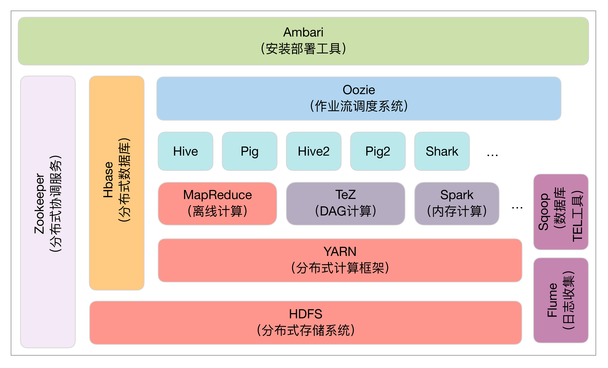
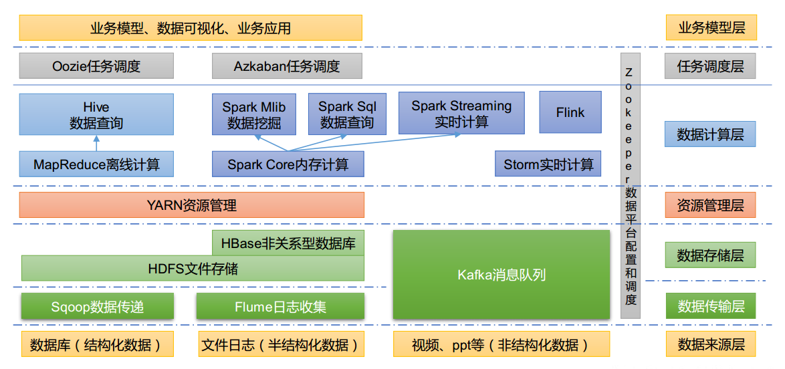

# Beecone

Beecone是在**Hadoop**开源软件的基础上，整合当前市面上Hadoop生态体系相对稳定的发行版的一站式集群环境搭建部署教程，提供简单明了的操作和配置，降低用户搭建环境的学习成本，从而缩短项目上线部署的周期，在使用该文档之前需要了解的是该项目处于维护阶段，会不定期更新教程内容，用户可以根据项目指引充分利用教程，快速搭建上手自己的项目。

# Hadoop生态体系

# Hadoop基本模块

**1）Hadoop基础功能库：**支持其他Hadoop模块的通用程序包。

**2）HDFS：**一个分布式文件系统，能够以高吞吐量访问应用中的数据。

**3）YARN：**一个作业调度和资源管理框架。

**4）MapReduce：**一个基于YARN的大数据并行处理程序。

**除了基本模块，Hadoop还包括以下项目。**

**1）Ambari：**基于Web，用于配置、管理和监控Hadoop集群。支持HDFS、MapReduce、Hive、HCatalog、HBase、ZooKeeper、Oozie、Pig和Sqoop。Ambari还提供显示集群健康状况的仪表盘，如热点图等。Ambari以图形化的方式查看MapReduce、Pig和Hive应用程序的运行情况，因此可以通过对用户友好的方式诊断应用的性能问题。

**2）Avro：**数据序列化系统。

**3）Cassandra：**可扩展的、无单点故障的NoSQL多主数据库。

**4）Chukwa：**用于大型分布式系统的数据采集系统。

**5）HBase：**可扩展的分布式数据库，支持大表的结构化数据存储。

**6）Hive：**数据仓库基础架构，提供数据汇总和命令行即席查询功能。

**7）Mahout：**可扩展的机器学习和数据挖掘库。

**8）Pig：**用于并行计算的高级数据流语言和执行框架。

**9）Spark：**可高速处理Hadoop数据的通用计算引擎。Spark提供了一种简单而富有表达能力的编程模式，支持ETL、机器学习、数据流处理、图像计算等多种应用。

**10）Tez：**完整的数据流编程框架，基于YARN建立，提供强大而灵活的引擎，可执行任意有向无环图（DAG）数据处理任务，既支持批处理又支持交互式的用户场景。Tez已经被Hive、Pig等Hadoop生态圈的组件所采用，用来替代 MapReduce作为底层执行引擎。

**11）ZooKeeper：**用于分布式应用的高性能协调服务。

除了以上这些官方认可的Hadoop生态圈组件之外，还有很多十分优秀的组件这里没有介绍，这些组件的应用也非常广泛，例如基于Hive查询优化的Presto、Impala、Kylin等。

此外，在Hadoop生态圈的周边，还聚集了一群“伙伴”，它们虽然未曾深入融合Hadoop生态圈，但是和Hadoop有着千丝万缕的联系，并且在各自擅长的领域起到了不可替代的作用。下图是阿里云E-MapReduce平台整合的Hadoop生态体系中的组件，比Apache提供的组合更为强大。

# Copyright and License

MIT License

Copyright (c) 2022 chawenjie

文档开源免费，并且将持续提供免费的社区技术支持。个人或企业内部可自由的接入和使用。

# [v-3.3.3-Beta](com/hxict/env/3.3.3)

后续版本升级计划中...

# [v-2.4.8](com/hxict/env/2.4.8)

在V-2.4.8版本中，我将对所有组件进行升级，主要是适应Spark-ML中的算法模块，Spark-2.3.0不满足当前的生产要求，因此需要对Spark相关组件进行升级。本次升级影响非常大，如果你的环境中存在重要数据,请提前做好备份。

| Java      | jdk-8u333-linux-x64.tar.gz               | Java 8/11/17                                                 |
| --------- | ---------------------------------------- | ------------------------------------------------------------ |
| Zookeeper | zookeeper-3.8.0.tar.gz                   | 只要是3.8.x版本即可                                          |
| Hadoop    | hadoop-3.3.3.tar.gz                      | Hadoop选用3.3.3是3.x系列最新版本，后续版本还会继续升级       |
| MySQL     | mysql-8.0.29-el7-x86_64.tar.gz           | mysql-8.0.29版本                                             |
| Hive      | apache-hive-3.1.3-bin.tar.gz             | Hive的版本需要与Hadoop的大版本保持一致                       |
| Scala     | scala-2.11.12.tgz                        | 需要根据自己的环境和Spark相对应                              |
| Spark     | spark-2.4.8-bin-hadoop3-without-hive.tgz | Spark版本与Hadoop大版本保持一致，选用特殊版本，自己编译不带Hive模块的spark |

### 升级：

1.  Zookeeper-3.8.0版本安装
2.  Hadoop-3.3.3版本安装
3.  Hive-3.1.3版本安装
4.  Spark-2.4.8（Hive-On-Spark）版本安装配置

# [v-2.3.0](com/hxict/env/2.3.0)

在V-2.3.0版本中，我们对部分组件进行升级，主要是适应Spark-ML中的算法模块，Spark-2.0.0不满足当前的生产要求，因此需要对Spark相关组件进行升级。

| Java      | jdk-8u333-linux-x64.tar.gz                   | jdk1.8即可                                                   |
| --------- | -------------------------------------------- | ------------------------------------------------------------ |
| Zookeeper | zookeeper-3.5.7.tar.gz                       | 只要是3.5.x版本即可                                          |
| Hadoop    | hadoop-2.7.7.tar.gz                          | Hadoop选用2.7是2.x系列最新版本，后续版本还会继续升级         |
| MySQL     | mysql-8.0.29-el7-x86_64.tar.gz               | mysql-8.0.29版本                                             |
| Hive      | apache-hive-2.3.9-bin.tar.gz                 | Hive的版本需要与Hadoop的大版本保持一致                       |
| Scala     | scala-2.11.12.tgz                            | 需要根据自己的环境和Spark相对应                              |
| Spark     | spark-2.3.0-bin-hadoop2.7.7-without-hive.tgz | Spark版本与Hadoop大版本保持一致，选用特殊版本，自己编译不带Hive模块的spark |

### 升级：

1.  MySQL8.0.29安装
2.  Hive-3.0.0版本安装
3.  Spark-2.3.0（Hive-On-Spark）

# [v-2.0.0](com/hxict/env/2.0.0)

在V-2.0.0版本中，Hadoop大数据环境搭建主要使用到如下版本的组件：

| Java      | jdk-8u333-linux-x64.tar.gz               | jdk1.8即可                                                   |
| --------- | ---------------------------------------- | ------------------------------------------------------------ |
| Zookeeper | zookeeper-3.5.7.tar.gz                   | 只要是3.5.x版本即可                                          |
| Hadoop    | hadoop-2.7.7.tar.gz                      | Hadoop选用2.7是2.x系列最新版本，后续版本还会继续升级         |
| Hive      | apache-hive-2.3.9-bin.tar.gz             | Hive的版本需要与Hadoop的大版本保持一致                       |
| MySQL     | mysql-5.7.37-el7-x86_64.tar.gz           | MySQL版本5.7                                                 |
| Scala     | scala-2.11.12.tgz                        | 需要根据自己的环境和Spark相对应                              |
| Spark     | spark-2.0.0-bin-hadoop2-without-hive.tgz | Spark版本与Hadoop大版本保持一致，选用特殊版本，自己编译不带Hive模块的spark |

### 安装：

1.  zookeeper-3.5.7安装
2.  hadoop-2.7.7安装
3.  hive-2.3.9安装
4.  mysql-5.7.37安装
5.  scala-2.11.12安装
6.  spark-2.0.0安装

# 提交维护

[参与贡献](issues/submit.md)

# Contact us

