# 集群环境搭建指南

## 集群资源介绍

搭建Hadoop高可用环境至少准备三台节点机，在其中两个节点部署NameNode服务，以保证HDFS的高可用，在两台机器上部署ResourceManager服务，以保证Yarn的高可用性，DataNode需要部署三个节点（生产环境通常与NameNode隔离，这里就不做拆分了），充分利用集群资源，JournalNode是一个可独立配置的集群，用于NameNode主备数据同步，Zookeeper作为分布式锁服务用于双NameNode竞选主服务，Hive是建立在Hadoop环境上的数据仓库，用于提供类SQL服务执行MR任务，Spark号称是下一代MR计算引擎，他拥有更快的计算速度，不亚于MR的吞吐能力能等优点，但基于多线程模式的Spark计算引擎，其稳定性要低于基于多进程模式的MapReduce计算框架。

| 服务器   | NameNode | DataNode | ResourceManager | NodeManager | JournalNode | Zookeeper | ZKFC | Hive | Spark-Master | Spark-slaves |
| -------- | -------- | -------- | --------------- | ----------- | ----------- | --------- | ---- | ---- | ------------ | ------------ |
| hadoop01 | √        | √        | √               | √           | √           | √         | √    | √    | √            |              |
| hadoop02 | √        | √        | √               | √           | √           | √         | √    |      |              | √            |
| hadoop03 |          | √        |                 | √           | √           | √         |      |      |              | √            |

## 软件版本介绍

| Java      | jdk-8u333-linux-x64.tar.gz                   | jdk1.8即可                                                   |
| --------- | -------------------------------------------- | ------------------------------------------------------------ |
| Zookeeper | zookeeper-3.5.7.tar.gz                       | 只要是3.5.x版本即可                                          |
| Hadoop    | hadoop-2.7.7.tar.gz                          | Hadoop选用2.7是2.x系列最新版本，后续版本还会继续升级         |
| MySQL     | mysql-8.0.29-el7-x86_64.tar.gz               | mysql-8.0.29版本                                             |
| Hive      | apache-hive-2.3.9-bin.tar.gz                 | Hive的版本需要与Hadoop的大版本保持一致                       |
| Scala     | scala-2.11.12.tgz                            | 需要根据自己的环境和Spark相对应                              |
| Spark     | spark-2.3.0-bin-hadoop2.7.7-without-hive.tgz | Spark版本与Hadoop大版本保持一致，选用特殊版本，自己编译不带Hive模块的spark |


# Java环境配置

因为三台机器都需要Java环境因此我们先在第一台虚拟机中安装Java环境，然后再进行克隆，得到另外两台虚拟机，这样就不用重复安装JDK了。通常情况下CentOS自带了一个Java，但是对于Hadoop大数据环境搭建过程中，我们需要对每一个组件工具做到掌控，因此建议大家在搭建的过程中卸载重装一个自己的Java环境，这样搭建的过程中有任何问题都可以准确方便的定位。


## 下载Java

Java自从被Oracle收购以后，下载就越来越不方便了需要登录Oracle的官网账号，JDK8下载链接，选择自己需要的版本下载即可。


## 卸载Java

```bash
# 查看当前的 java 信息
[root@localhost src]# rpm -qa|grep java
java-1.8.0-openjdk-1.8.0.262.b10-1.el7.x86_64
javapackages-tools-3.4.1-11.el7.noarch
tzdata-java-2020a-1.el7.noarch
python-javapackages-3.4.1-11.el7.noarch
java-1.8.0-openjdk-headless-1.8.0.262.b10-1.el7.x86_64
```

使用rpm -e --nodeps命令卸载java，可以忽略noarch，但是如果你有强迫症那就一并卸载了吧看着舒服

```bash
[root@localhost src]# rpm -e --nodeps java-1.8.0-openjdk-1.8.0.262.b10-1.el7.x86_64
[root@localhost src]# rpm -e --nodeps javapackages-tools-3.4.1-11.el7.noarch
[root@localhost src]# rpm -e --nodeps tzdata-java-2020a-1.el7.noarch
[root@localhost src]# rpm -e --nodeps python-javapackages-3.4.1-11.el7.noarch
[root@localhost src]# rpm -e --nodeps java-1.8.0-openjdk-headless-1.8.0.262.b10-1.el7.x86_64
```

再次查询看看java是否已经卸载干净了

```bash
[root@localhost src]# rpm -qa|grep java
```

删除自带的java文件夹(我有强迫症)

```bash
# 查看java文件夹
[root@localhost src]# whereis java
java: /usr/share/java
 
# 删除文件夹
[root@localhost src]# cd /usr/share
[root@localhost share]# rm -rf java
```


## 安装Java

将下载好的jdk上传至指定路径，我的习惯是在/usr/local/src路径下放置我们下载的所有安装包，然后在local目录(也就是src的同级)下，新建一个soft文件夹，以后所有的软件都可以在这里统一安装管理，将tgz的包解压至soft目录下。

```bash
# 资源下载目录
/usr/local/src
# 软件安装目录
/usr/local/soft

# 解压jdk
[root@localhost src]# tar -zxvf jdk-8u333-linux-x64.tar.gz
[root@localhost src]# mv jdk1.8.0_333 ../soft/
```

## 配置Java

修改环境变量配置文件profile，在profile文件末尾增加如下配置信息，JAVA_HOME根据自己的版本路径信息配置

```bash
[root@localhost jdk1.8.0_333]# vim /etc/profile

# I have some profile modify log in start this line
export JAVA_HOME=/usr/local/soft/jdk1.8.0_333
export JRE_HOME=${JAVA_HOME}/jre
export CLASSPATH=.:${JRE_HOME}/lib/rt.jar:${JAVA_HOME}/lib/dt.jar:${JAVA_HOME}/lib/tools.jar
export PATH=.:${PATH}:${JAVA_HOME}/bin:${JRE_HOME}/bin

# 完成后保存配置文件在source一下强制生效
[root@localhost jdk1.8.0_333]# source /etc/profile
```

执行java命令查看jkd是否安装成功，出现如下效果即表示安装完成，jre的测试命令java / javac出现类似如下输出即表示java配置无误，如果无法正确出现，则将上面的过程再来一遍

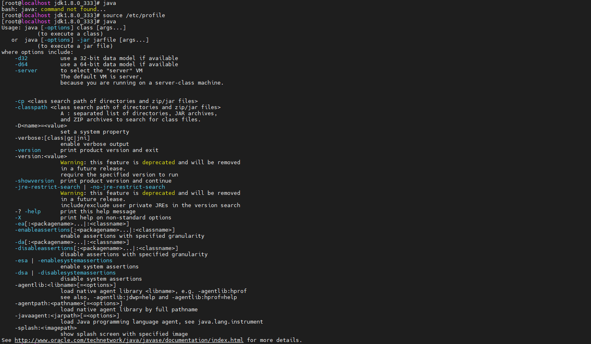

 

# Linux环境配置

## 关闭安全机制

修改内核防火墙配置信息，将SELINUX修改为disabled即可，保存关闭

```bash
[root@192 ~]# vim /etc/selinux/config
# This file controls the state of SELinux on the system.
# SELINUX= can take one of these three values:
#     enforcing - SELinux security policy is enforced.
#     permissive - SELinux prints warnings instead of enforcing.
#     disabled - No SELinux policy is loaded.
SELINUX=disabled
```


## 修改物理机

接下来对机器的修改和配置需要在三台机器上逐个操作，保证三台机器同时开启正常可用即可。

### 修改主机名

启动hadoop01虚拟机，添加如下信息，修改主机名如下

```bash
[root@192 ~]# vim /etc/sysconfig/network
# Created by anaconda

NETWORKING=yes
HOSTNAME=hadoop01
```

### 修改IP地址

通常情况下IP地址所在的配置文件名叫ifcfg-ens33，在如下路径，如果没有找到ifcfg-ens33这个文件名的话，考虑是否有类似的，有的系统是叫ifcfg-eth0，总之其内容都是一样的，可以用ifconfig来查看是否是这个网卡配置

```bash
[root@hadoop02 sbin]# ifconfig
ens33: flags=4163<UP,BROADCAST,RUNNING,MULTICAST>  mtu 1500
        inet 192.168.110.122  netmask 255.255.255.0  broadcast 192.168.110.255
        inet6 fe80::4d8c:9150:a978:8e55  prefixlen 64  scopeid 0x20<link>
        inet6 fe80::59b5:9c37:5afd:fa2e  prefixlen 64  scopeid 0x20<link>
        ether 00:0c:29:05:f1:0a  txqueuelen 1000  (Ethernet)
        RX packets 854824  bytes 1086838364 (1.0 GiB)
        RX errors 0  dropped 0  overruns 0  frame 0
        TX packets 727063  bytes 1468170707 (1.3 GiB)
        TX errors 0  dropped 0 overruns 0  carrier 0  collisions 0

lo: flags=73<UP,LOOPBACK,RUNNING>  mtu 65536
        inet 127.0.0.1  netmask 255.0.0.0
        inet6 ::1  prefixlen 128  scopeid 0x10<host>
        loop  txqueuelen 1000  (Local Loopback)
        RX packets 95789  bytes 386494699 (368.5 MiB)
        RX errors 0  dropped 0  overruns 0  frame 0
        TX packets 95789  bytes 386494699 (368.5 MiB)
        TX errors 0  dropped 0 overruns 0  carrier 0  collisions 0

virbr0: flags=4099<UP,BROADCAST,MULTICAST>  mtu 1500
        inet 192.168.122.1  netmask 255.255.255.0  broadcast 192.168.122.255
        ether 52:54:00:b7:ee:d7  txqueuelen 1000  (Ethernet)
        RX packets 0  bytes 0 (0.0 B)
        RX errors 0  dropped 0  overruns 0  frame 0
        TX packets 0  bytes 0 (0.0 B)
        TX errors 0  dropped 0 overruns 0  carrier 0  collisions 0
```

```bash
# 修改网卡信息-修改IP地址
[root@192 ~]# vim /etc/sysconfig/network-scripts/ifcfg-ens33
TYPE=Ethernet
PROXY_METHOD=none
BROWSER_ONLY=no
BOOTPROTO=static
DEFROUTE=yes
IPV4_FAILURE_FATAL=no
IPV6INIT=yes
IPV6_AUTOCONF=yes
IPV6_DEFROUTE=yes
IPV6_FAILURE_FATAL=no
IPV6_ADDR_GEN_MODE=stable-privacy
NAME=ens33
UUID=8507fbf4-7b59-4c82-8321-f5011b70a3bb
DEVICE=ens33
ONBOOT=yes
IPADDR=192.168.110.121
NETMASK=255.255.255.0
GATEWAY=192.168.110.2
DNS1=114.114.114.114
DNS2=8.8.8.8

# 完成后重启网络
[root@192 ~]# service network restart
```


### 配置主机名映射

```bash
[root@192 ~]# /etc/hosts
127.0.0.1   localhost localhost.localdomain localhost4 localhost4.localdomain4
::1         localhost localhost.localdomain localhost6 localhost6.localdomain6

192.168.110.121 hadoop01
192.168.110.122 hadoop02
192.168.110.123 hadoop03
```

完成以上配置后，三台机器可以同时启动，并可以相互ping、通信。


### SSH互信配置

当前三台机器无法相互免密登录，配置一个SSH的免密登录。使用如下命令生成SSH的公、私秘钥，在三台机器上分别执行如下命令：

```bash
[root@hadoop01 ~]# ssh-keygen -t rsa
Generating public/private rsa key pair.
Enter file in which to save the key (/root/.ssh/id_rsa): 
Created directory '/root/.ssh'.
Enter passphrase (empty for no passphrase): 
Enter same passphrase again: 
Your identification has been saved in /root/.ssh/id_rsa.
Your public key has been saved in /root/.ssh/id_rsa.pub.
The key fingerprint is:
SHA256:3ZTBQqZkLapGQePNu6BkMDF6JQRjVCgSt/N0czeawT8 root@hadoop01
The key's randomart image is:
+---[RSA 2048]----+
|B**o+   ooo..    |
|=* =.+ +.oo .o   |
|* + o.=.=.o.o    |
| + +...+ B +     |
|  o.o.. S E .    |
| o .o. .   .     |
|  ..  .          |
|                 |
|                 |
+----[SHA256]-----+
```

再在三台机器上分别执行如下命令，会分别在各自机器的/root/.ssh/目录下生成authorized_keys文件:

```bash
[root@hadoop01 .ssh]# cat /root/.ssh/id_rsa.pub > /root/.ssh/authorized_keys
```

在hadoop01机器上执行如下两条命令，把hadoop02和hadoop03两台机器上的公钥信息收集到本机:

```bash
[root@hadoop01 .ssh]# ssh hadoop02 cat /root/.ssh/authorized_keys >> /root/.ssh/authorized_keys
 
[root@hadoop01 .ssh]# ssh hadoop03 cat /root/.ssh/authorized_keys >> /root/.ssh/authorized_keys
```

最后分别在hadoop02和hadoop03两台机器上执行如下命令:

```bash
[root@hadoop02 .ssh]# ssh hadoop01 cat /root/.ssh/authorized_keys > /root/.ssh/authorized_keys
[root@hadoop03 .ssh]# ssh hadoop01 cat /root/.ssh/authorized_keys > /root/.ssh/authorized_keys
```

完事儿后，可以使用ssh相互登录，比如我在hadoop02这台机器上可以直接登录hadoop01，并且操作hadoop01如同本机一样方便。

```bash
[root@hadoop02 .ssh]# ssh hadoop01
Last login: Sat May 28 17:17:56 2022 from 192.168.124.1
[root@hadoop01 .ssh]#
```

需要注意的是：如果默认的SSH通信端口22不可用的话，SSH命令如下：

```bash
# ssh 命令
[root@hadoop01 ~]# ssh -p {new_port} {user}@{hostname}:/{path}
# scp 命令
[root@hadoop01 ~]# scp -P {new_port} -r {source} {user}@{hostname}:/{target_path}
```


# Zookeeper集群搭建

## 简介

ZooKeeper是一个[分布式](https://baike.baidu.com/item/分布式/19276232)的，开放源码的[分布式应用程序](https://baike.baidu.com/item/分布式应用程序/9854429)协调服务，是[Google](https://baike.baidu.com/item/Google)的Chubby一个[开源](https://baike.baidu.com/item/开源/246339)的实现，是Hadoop和[Hbase](https://baike.baidu.com/item/Hbase/7670213)的重要组件。它是一个为分布式应用提供一致性服务的软件，提供的功能包括：配置维护、域名服务、分布式同步、组服务等。ZooKeeper的目标就是封装好复杂易出错的关键服务，将简单易用的接口和性能高效、功能稳定的系统提供给用户。ZooKeeper包含一个简单的原语集，提供Java和C的接口。ZooKeeper代码版本中，提供了分布式独享锁、选举、队列的接口，代码在$ZOOKEEPER_HOOOME\src\recipes。其中分布锁和队列有[Java](https://baike.baidu.com/item/Java/85979)和C两个版本，选举只有Java版本。

## 下载软件

Zookeeper下载可以在[Zookeeper官网](https://zookeeper.apache.org/releases.html#download)找到合适的版本。最新版本以及最近的几个版本可以在[清华源](https://mirrors.tuna.tsinghua.edu.cn/apache/zookeeper/)、[科大源](https://mirrors.ustc.edu.cn/apache/zookeeper/)等国内镜像中下载，但历史版本还是需要去Apache下载，在Download下**Older releases are available [in the archive](https://archive.apache.org/dist/zookeeper/)**。

| [zookeeper-3.5.7](https://archive.apache.org/dist/zookeeper/zookeeper-3.5.7) | 2020-02-14 12:32 | -    |
| ------------------------------------------------------------ | ---------------- | ---- |
|                                                              |                  |      |


## 修改配置

```bash
# 将下载好的安装包解压
[root@hadoop01 src]# tar -zxvf apache-zookeeper-3.5.7-bin.tar.gz
# 修改名字然后mv到目标安装目录中
[root@hadoop01 src]# mv apache-zookeeper-3.5.7-bin.tar.gz  zookeeper-3.5.7
[root@hadoop01 src]# mv zookeeper-3.5.7 ../soft/

# 进入到zookeeper-3.5.7目录下创建两个文件夹data和log  
[root@hadoop01 zookeeper-3.5.7]# mkdir data  
[root@hadoop01 zookeeper-3.5.7]# mkdir log 

# 然后进入conf目录修改配置信息  
[root@hadoop01 zookeeper-3.5.7]# cd conf  
[root@hadoop01 conf]# mv zoo_sample.cfg zoo.cfg 

# 修改配置zoo.cfg
[root@hadoop01 conf]# vim zoo.cfg
dataDir=/usr/local/soft/zookeeper-3.5.7/data
dataLogDir=/usr/local/soft/zookeeper-3.5.7/log

#autopurge.purgeInterval=1
server.1=hadoop01:2888:3888
server.2=hadoop02:2888:3888
server.3=hadoop03:2888:3888
```


增加环境变量的配置信息，配置完成后强制刷新配置文件，修改环境变量 

```bash
[root@hadoop01 conf]# vim /etc/profile 
export ZOOKEEPER_HOME=/usr/local/soft/zookeeper-3.5.7
export PATH=.:${PATH}:${JAVA_HOME}/bin:${JRE_HOME}/bin:$ZOOKEEPER_HOME/bin
# 刷新环境变量 
[root@hadoop01 conf]# source /etc/profile 
```

完成后将hadoop01节点已经完成配置的zookeeper-3.5.7安装包分别分发复制到hadoop02和hadoop03节点的软件安装目录/usr/local/soft/下

```bash
[root@hadoop01 soft]# scp -r zookeeper-3.5.7 root@hadoop02:/usr/local/soft/
[root@hadoop01 soft]# scp -r zookeeper-3.5.7 root@hadoop03:/usr/local/soft/
```

在/usr/local/soft/zookeeper-3.5.7/data/目录下，创建文件myid，同时修改各节点myid的值，使用如下命令分别在三个节点快速创建修改三台机器的myid文件

```bash
[root@hadoop01 soft]# echo "1" > /usr/local/soft/zookeeper-3.5.7/data/myid
[root@hadoop02 soft]# echo "2" > /usr/local/soft/zookeeper-3.5.7/data/myid
[root@hadoop03 soft]# echo "3" > /usr/local/soft/zookeeper-3.5.7/data/myid
```

## 启停服务

```bash
# 启动Zookeeper
[root@hadoop01 soft]# zkServer.sh start
ZooKeeper JMX enabled by default
Using config: /usr/local/soft/zookeeper-3.5.7/bin/../conf/zoo.cfg
Starting zookeeper ... STARTED

# 停止Zookeeper
[root@hadoop01 soft]# zkServer.sh stop
ZooKeeper JMX enabled by default
Using config: /usr/local/soft/zookeeper-3.5.7/bin/../conf/zoo.cfg
Stopping zookeeper ... STOPPED

# 查看当前Zookeeper服务状态
[root@hadoop01 soft]# zkServer.sh status
ZooKeeper JMX enabled by default
Using config: /usr/local/soft/zookeeper-3.5.7/bin/../conf/zoo.cfg
Client port found: 2181. Client address: localhost.
Mode: follower

# jps命令查看刚刚启动的zookeeper服务：QuorumPeerMain
[root@hadoop01 bin]# jps
9297 QuorumPeerMain
9416 Jps
```


## 启动集群

ZK的集群启动非常简单，只需要在三个节点挨个儿执行启动命令即可，然后查看每个节点启动是否正常，jps查看各节点ZK的主程序是否存活即可，通常没有报错就不会有问题，ZK集群是整个Hadoop集群环境系列搭建最简单的。当然ZK还提供了非常丰富的功能，需要的小伙伴可以自行查看学习使用。


## 补充一: 一键启停

ZK本身不提供一键启动所有节点服务的启动脚本，我们可以自己安排一个，具体的代码示例如下，参考实现:

```bash
# 一键启动
# zkStart-all.sh
# start zk cluster
for host in hadoop01 hadoop02 hadoop03
do
        echo "===========start zk cluster :$host==============="
        ssh  $host 'source /etc/profile; /usr/local/soft/zookeeper-3.5.7/bin/zkServer.sh start'
done
sleep 3s
#check status
for host in hadoop01 hadoop02 hadoop03
do
        echo "===========checking zk node status :$host==============="
        ssh  $host 'source /etc/profile; /usr/local/soft/zookeeper-3.5.7/bin/zkServer.sh status'
done

```

```bash
# 一键停机
# zkStop-all.sh
# stop zk cluster
for host in hadoop01 hadoop02 hadoop03
do
        echo "===========$host==============="
        ssh  $host 'source /etc/profile; /usr/local/soft/zookeeper-3.5.7/bin/zkServer.sh stop'
done

```


## 补充二: 服务启动失败，端口被占用

这种情况比较少见，通常跟用户的权限有关，ZK服务启动无异常，JPS不显示QuorumPeerMain服务进程，但查看2181端口显示已经被绑定，处理办法比较简单，kill掉绑定该端口的java进程，重新启动ZK就可以了，这里的java进程实际上就是QuorumPeerMain进程。


# Hadoop-HA集群搭建

## 简介

Hadoop是一个由Apache基金会所开发的[分布式系统](https://baike.baidu.com/item/分布式系统/4905336)基础架构。用户可以在不了解分布式底层细节的情况下，开发分布式程序。充分利用集群的威力进行高速运算和存储。Hadoop实现了一个[分布式文件系统](https://baike.baidu.com/item/分布式文件系统/1250388)（ Distributed File System），其中一个组件是[HDFS](https://baike.baidu.com/item/HDFS/4836121)（Hadoop Distributed File System）。HDFS有高[容错性](https://baike.baidu.com/item/容错性/9131391)的特点，并且设计用来部署在低廉的（low-cost）硬件上；而且它提供高吞吐量（high throughput）来访问[应用程序](https://baike.baidu.com/item/应用程序/5985445)的数据，适合那些有着超大数据集（large data set）的应用程序。HDFS放宽了（relax）[POSIX](https://baike.baidu.com/item/POSIX/3792413)的要求，可以以流的形式访问（streaming access）文件系统中的数据。Hadoop的框架最核心的设计就是：[HDFS](https://baike.baidu.com/item/HDFS/4836121)和[MapReduce](https://baike.baidu.com/item/MapReduce/133425)。HDFS为海量的数据提供了存储，而MapReduce则为海量的数据提供了计算。

## 下载软件

Hadoop官网[下载](https://archive.apache.org/dist/hadoop/common/)链接,这里再推荐一个[腾讯源](https://mirrors.cloud.tencent.com/apache/hadoop/core/hadoop-2.10.1/)下载地址,速度快很多,可以下载自己需要的版本,这里选取的是Hadoop-2.7.7,也是Hadoop2.7.x系列当前最新的一个版本，本次环境搭建不限于2.7.x只需要是2.x系列即可。

## 修改配置

**注：接下来的配置在适应不同的组件时还需要做其他修改优化，当前只做简单的配置完成基本的高可用集群环境的搭建。**

将/usr/local/src/ 目录下的hadoop安装包解压修改名称后移动至/usr/local/soft/目录下，然后修改Hadoop配置信息。配置文件路径$HADOOP_HOME/etc/hadoop/下，按如下配置保存配置文件即可：

### hadoop_env.sh

```bash
# 修改hadoop_env.sh启动环境变量，Hadoop独立配置。
export JAVA_HOME=/usr/local/soft/jdk1.8.0_333
export HADOOP_CONF_DIR=/usr/local/soft/hadoop-2.7.7/etc/hadoop
```

### core-site.xml

```xml
<configuration>
    <property>
          <name>fs.defaultFS</name>
          <value>hdfs://masters</value>
    </property>
    <property>
          <name>hadoop.tmp.dir</name>
          <value>/usr/local/soft/hadoop-2.7.7/tmp</value>
    </property>
    <property>
           <name>ha.zookeeper.quorum</name>
           <value>hadoop01:2181,hadoop02:2181,hadoop03:2181</value>
    </property>
    <property>
        <!--设置缓存大小，默认4kb-->
        <name>io.file.buffer.size</name>
        <value>4096</value>
    </property>
    <property>
        <name>hadoop.proxyuser.root.hosts</name>
        <value>*</value>
    </property>
    <property>
        <name>hadoop.proxyuser.root.groups</name>
        <value>*</value>
    </property>
</configuration>
```

### hdfs-site.xml

```bash
# 在hadoop安装包的根目录下新建如下文件夹
[root@hadoop01 hadoop-2.7.7]# mkdir -p tmp
[root@hadoop01 hadoop-2.7.7]# mkdir -p dfs/data/journalnode
[root@hadoop01 hadoop-2.7.7]# mkdir -p dfs/edits
[root@hadoop01 hadoop-2.7.7]# mkdir -p dfs/data/datanode
[root@hadoop01 hadoop-2.7.7]# mkdir -p dfs/data/namenode
```


```xml
<?xml version="1.0" encoding="UTF-8"?>
<?xml-stylesheet type="text/xsl" href="configuration.xsl"?>
<!--
  Licensed under the Apache License, Version 2.0 (the "License");
  you may not use this file except in compliance with the License.
  You may obtain a copy of the License at

    http://www.apache.org/licenses/LICENSE-2.0

  Unless required by applicable law or agreed to in writing, software
  distributed under the License is distributed on an "AS IS" BASIS,
  WITHOUT WARRANTIES OR CONDITIONS OF ANY KIND, either express or implied.
  See the License for the specific language governing permissions and
  limitations under the License. See accompanying LICENSE file.
-->

<!-- Put site-specific property overrides in this file. -->
<configuration>
        <property>
            <!--数据块默认大小128M-->
            <name>dfs.block.size</name>
            <value>134217728</value>
        </property>
        <!--设置副本个数-->
        <property>
                <name>dfs.replication</name>
                <value>3</value>
        </property>
        <!--设置namenode.name目录-->
        <property>
                <name>dfs.namenode.name.dir</name>
                <value>/usr/local/soft/hadoop-2.7.7/dfs/data/namenode</value>
        </property>
        <!--设置namenode.data目录-->
        <property>
                <name>dfs.datanode.data.dir</name>
                <value>/usr/local/soft/hadoop-2.7.7/dfs/data/datanode</value>
        </property>
        <!--开启WebHDFS-->
        <property>
                <name>dfs.webhdfs.enabled</name>
                <value>true</value>
        <!--在NN和DN上开启webHDFS（REST API）功能，不是必须-->
        </property>
        <property>
            <name>dfs.datanode.max.transfer.threads</name>
            <value>4096</value>
        </property>
        <!--指定HDFS的那么nameservice为masters,需要和core-site.xml中的保持一致-->
        <property>
                <name>dfs.nameservices</name>
                <value>masters</value>
        </property>
        <!--masters下面有两个namenode，分别是nn1和nn2-->
        <property>
                <name>dfs.ha.namenodes.masters</name>
                <value>nn1,nn2</value>
        </property>
        <!--nn1的RPC通信地址-->
        <property>
                <name>dfs.namenode.rpc-address.masters.nn1</name>
                <value>hadoop01:9000</value>
        </property>
        <!--nn1的http通信地址-->
        <property>
                <name>dfs.namenode.http-address.masters.nn1</name>
                <value>hadoop01:50070</value>
        </property>
        <property>
            <name>dfs.namenode.servicepc-address.masters.nn1</name>
            <value>hadoop01:53310</value>
        </property>
        <!--nn2的RPC通信地址-->
        <property>
                <name>dfs.namenode.rpc-address.masters.nn2</name>
                <value>hadoop02:9000</value>
        </property>
        <!--nn2的http通信地址-->
                <property>
                <name>dfs.namenode.http-address.masters.nn2</name>
                <value>hadoop02:50070</value>
        </property>
        <property>
            <name>dfs.namenode.servicepc-address.masters.nn2</name>
            <value>hadoop02:53310</value>
        </property>
        <!--指定namenode的元数据在JournalNode上的存放位置-->
        <property>
                <name>dfs.namenode.shared.edits.dir</name>
                <value>qjournal://hadoop01:8485;hadoop02:8485;hadoop03:8485/masters</value>
        </property>
        <!--指定JournalNode在本地磁盘存放数据的位置-->
        <property>
                <name>dfs.journalnode.edits.dir</name>
                <value>/usr/local/soft/hadoop-2.7.7/dfs/data/journalnode</value>
        </property>
        <property>
            <!-- namenode操作日志的存放位置 -->
            <name>dfs.namenode.edits.dir</name>
            <value>/usr/local/soft/hadoop-2.7.7/dfs/edits</value>
        </property>
        <!--开启namenode失败自动切换-->
        <property>
                <name>dfs.ha.automatic-failover.enabled</name>
                <value>true</value>
        </property>
        <!--配置失败自启动切换实现方式-->
        <property>
                <name>dfs.client.failover.proxy.provider.masters</name>
                <value>org.apache.hadoop.hdfs.server.namenode.ha.ConfiguredFailoverProxyProvider</value>
        </property>
        <!--配置隔离机制方法，多个机制用换行分割，即每个机制暂用一行-->
        <property>
                <name>dfs.ha.fencing.methods</name>
                <value>sshfence</value>
        </property>
        <!--使用sshfence隔离机制时需要ssh免登录-->
        <property>
                <name>dfs.ha.fencing.ssh.private-key-files</name>
                <value>/root/.ssh/id_rsa</value>
        </property>
        <property>
            <!--hdfs文件操作权限,false为不验证-->
            <name>dfs.permissions</name> 
            <value>false</value>
        </property>
</configuration>
```


### yarn-site.xml

```xml
<?xml version="1.0"?>
<!--
  Licensed under the Apache License, Version 2.0 (the "License");
  you may not use this file except in compliance with the License.
  You may obtain a copy of the License at

    http://www.apache.org/licenses/LICENSE-2.0

  Unless required by applicable law or agreed to in writing, software
  distributed under the License is distributed on an "AS IS" BASIS,
  WITHOUT WARRANTIES OR CONDITIONS OF ANY KIND, either express or implied.
  See the License for the specific language governing permissions and
  limitations under the License. See accompanying LICENSE file.
-->
<configuration>
    <property>
            <name>yarn.resourcemanager.ha.enabled</name>
            <value>true</value>
    </property>
    <!--指定ResourceManager的cluster id-->
    <property>
            <name>yarn.resourcemanager.cluster-id</name>
            <value>hayarn</value>
    </property>
    <!--指定ResourceManager的名字-->
    <property>
            <name>yarn.resourcemanager.ha.rm-ids</name>
            <value>rm1,rm2</value>
    </property>
    <!--分别指定ResourceManager的地址-->
    <property>
            <name>yarn.resourcemanager.hostname.rm1</name>
            <value>hadoop01</value>
    </property>
    <property>
            <name>yarn.resourcemanager.hostname.rm2</name>
            <value>hadoop02</value>
    </property>
    <!--指定Zookeeper集群的地址-->
    <property>
            <name>yarn.resourcemanager.zk-address</name>
            <value>hadoop01:2181,hadoop02:2181,hadoop03:2181</value>
    </property>
    <property>
        <!-- 开启Yarn恢复机制 -->
        <name>yarn.resourcemanager.recovery.enabled</name>
        <value>true</value>
    </property> 
    <property>
        <!-- 配置执行ResourceManager恢复机制实现类 -->
        <name>yarn.resourcemanager.store.class</name>
            <value>org.apache.hadoop.yarn.server.resourcemanager.recovery.ZKRMStateStore</value>
    </property>
    <property>
        <!--指定主resourcemanager的地址-->
        <name>yarn.resourcemanager.hostname</name>
        <value>hadoop01</value>
    </property>
    <property>
            <name>yarn.nodemanager.aux-services</name>
            <value>mapreduce_shuffle</value>
    </property>
    <property>
        <!--开启日志聚集功能-->
        <name>yarn.log-aggregation-enable</name>
        <value>true</value>
    </property>
    <property>
        <!--配置日志保留7天-->
        <name>yarn.log-aggregation.retain-seconds</name>
        <value>604800</value>
    </property>
    <property>
        <name>yarn.nodemanager.vmem-check-enabled</name>
        <value>false</value>
    </property>
    <property>
        <name>yarn.log.server.url</name>
        <value>http://hadoop01:19888/jobhistory/logs</value>
    </property>
    <!--下面的配置可以不用,配置了可以在8088UI界面从运行期日志跳转到历史日志-->
    <property>
        <name>yarn.nodemanager.remote-app-log-dir</name>
        <value>hdfs://masters/tmp/logs</value>
    </property>
</configuration>
```


### mapred-site.xml

```xml
<?xml version="1.0"?>
<?xml-stylesheet type="text/xsl" href="configuration.xsl"?>
<!--
  Licensed under the Apache License, Version 2.0 (the "License");
  you may not use this file except in compliance with the License.
  You may obtain a copy of the License at

    http,//www.apache.org/licenses/LICENSE-2.0

  Unless required by applicable law or agreed to in writing, software
  distributed under the License is distributed on an "AS IS" BASIS,
  WITHOUT WARRANTIES OR CONDITIONS OF ANY KIND, either express or implied.
  See the License for the specific language governing permissions and
  limitations under the License. See accompanying LICENSE file.
-->

<!-- Put site-specific property overrides in this file. -->

<configuration>
    <property>
        <name>mapreduce.framework.name</name>
        <value>yarn</value>
    </property>
    <!-- 历史服务器端地址 -->
    <property>
        <name>mapreduce.jobhistory.address</name>
        <value>hadoop01:10020</value>
	</property>
    <!-- 历史服务器 web 端地址 -->
    <property>
        <name>mapreduce.jobhistory.webapp.address</name>
        <value>hadoop01:19888</value>
    </property>
    <property>
        <!--开启uber模式-->
        <name>mapreduce.job.ubertask.enable</name>
        <value>true</value>
    </property>
</configuration>
```


### slaves

```bash
hadoop01
hadoop02
hadoop03
```


### 分发安装包

```bash
# 将当前机器已经修改的安装包分发至其他机器节点，组成集群。（云主机条件下建议将安装包压缩后分发，速度更快，或者直接本地修改后拷贝至多个节点）
[root@hadoop01 soft]# scp -r /usr/local/soft/hadoop-2.7.7 root@hadoop02:/usr/local/soft/
[root@hadoop01 soft]# scp -r /usr/local/soft/hadoop-2.7.7 root@hadoop03:/usr/local/soft/
```

### 添加环境变量

```bash
export HADOOP_HOME=/usr/local/soft/hadoop-2.7.7
export PATH=.:${PATH}:${JAVA_HOME}/bin:${JRE_HOME}/bin:${ZOOKEEPER_HOME}/bin:${HADOOP_HOME}/bin
```


## 启动集群

**注：启动Hadoop集群之前需要保证Zookeeper集群已经启动。**

### 启动JournaNode（仅初次需要）

```bash
# 启动journalnode，三台机器都要这一步操作（仅第一次启动hadoop时，需要这一步操作，之后不再需要手动启动journalnode）
[root@hadoop01 sbin]# ./hadoop-daemon.sh start journalnode
starting journalnode, logging to /usr/local/soft/hadoop-2.7.7/logs/hadoop-root-journalnode-hadoop01.out
[root@hadoop01 sbin]# jps
6500 QuorumPeerMain
6759 Jps
```


### 格式化NameNode（仅初次需要）

```bash
# 在hadoop01上执行NameNode格式化操作，格式化NameNode。使用如下命令，得到如图所示的提示信息，则表示NameNode格式化成功。
[root@hadoop01 /]# hdfs namenode -format
```

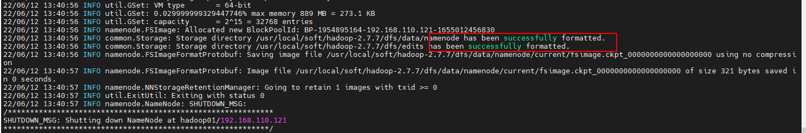

### 主从数据同步（仅初次需要）

```bash
# 复制hadoop01上的NameNode的元数据到hadoop02对应的元数据存储位置，用于HA集群的standby元数据信息同步
[root@hadoop01 namenode]# pwd
/usr/local/soft/hadoop-2.7.7/dfs/data/namenode
[root@hadoop01 namenode]# scp -r current root@hadoop02:/usr/local/soft/hadoop-2.7.7/dfs/data/namenode/
```

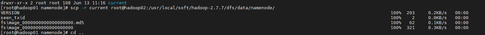


### 格式化ZKFC（仅初次需要）

```bash
# 在hadoop01上执行ZKFC格式化操作，格式化ZKFC。使用如下命令，得到如图所示的提示信息，则表示ZKFC格式化成功。【二者选其一即可】  
[xiaokang@hadoop01 ~]$ hdfs zkfc -formatZK
或  
[xiaokang@hadoop02 ~]$ hdfs zkfc -formatZK
```

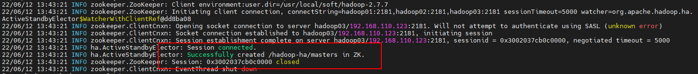

### 启动HDFS

```bash
# 在Hadoop的sbin目录下执行如下命令，启动HDFS（也就是NameNode和DataNode的启动）：可以看到启动了两个namenode一主一备、三个datanode，三个journalnode、两个zkfc  
[root@hadoop01 sbin]# ./start-dfs.sh
Starting namenodes on [hadoop01 hadoop02]
hadoop01: starting namenode, logging to /usr/local/soft/hadoop-2.7.7/logs/hadoop-root-namenode-hadoop01.out
hadoop02: starting namenode, logging to /usr/local/soft/hadoop-2.7.7/logs/hadoop-root-namenode-hadoop02.out
hadoop02: starting datanode, logging to /usr/local/soft/hadoop-2.7.7/logs/hadoop-root-datanode-hadoop02.out
hadoop01: starting datanode, logging to /usr/local/soft/hadoop-2.7.7/logs/hadoop-root-datanode-hadoop01.out
hadoop03: starting datanode, logging to /usr/local/soft/hadoop-2.7.7/logs/hadoop-root-datanode-hadoop03.out
Starting journal nodes [hadoop01 hadoop02 hadoop03]
hadoop01: starting journalnode, logging to /usr/local/soft/hadoop-2.7.7/logs/hadoop-root-journalnode-hadoop01.out
hadoop03: starting journalnode, logging to /usr/local/soft/hadoop-2.7.7/logs/hadoop-root-journalnode-hadoop03.out
hadoop02: starting journalnode, logging to /usr/local/soft/hadoop-2.7.7/logs/hadoop-root-journalnode-hadoop02.out
Starting ZK Failover Controllers on NN hosts [hadoop01 hadoop02]
hadoop01: starting zkfc, logging to /usr/local/soft/hadoop-2.7.7/logs/hadoop-root-zkfc-hadoop01.out
hadoop02: starting zkfc, logging to /usr/local/soft/hadoop-2.7.7/logs/hadoop-root-zkfc-hadoop02.out
```

**特别注意：如果启动HDFS以后发现主节点的NameNode启动而从节点的NameNode未启动，但检查整个搭建流程都没有问题的时候，可以试试如下命令在从节点进行数据同步，完成后再重新启动HDFS集群。**

```bash
[root@hadoop02 sbin]# hdfs namenode -bootstrapStandby
```


### 启动Yarn

```bash
# 执行如下命令，Yarn是一个资源管理器，因此会启动一个独立的全局资源管理器RM以及各个节点自己的独立资源管理器NodeManager。
[root@hadoop01 sbin]# ./start-yarn.sh
starting yarn daemons
starting resourcemanager, logging to /usr/local/soft/hadoop-2.7.7/logs/yarn-root-resourcemanager-hadoop01.out
hadoop01: starting nodemanager, logging to /usr/local/soft/hadoop-2.7.7/logs/yarn-root-nodemanager-hadoop01.out
hadoop02: starting nodemanager, logging to /usr/local/soft/hadoop-2.7.7/logs/yarn-root-nodemanager-hadoop02.out
hadoop03: starting nodemanager, logging to /usr/local/soft/hadoop-2.7.7/logs/yarn-root-nodemanager-hadoop03.out
```


需要注意的是，在[配置Yarn](#_yarn-site.xml)的时候，我们配置了一个参数yarn.resourcemanager.ha.rm-ids，来指定多个RM，也就是RM的高可用，那这里只启动了hadoop01节点的RM，还需要手动启动hadoop02节点的RM，使用如下命令在hadoop02上启动RM。

```bash
[root@hadoop02 sbin]# ./yarn-daemon.sh start resourcemanager
starting resourcemanager, logging to /usr/local/soft/hadoop-2.7.7/logs/yarn-root-resourcemanager-hadoop02.out
```


到这里实际上整个Hadoop集群已经成功启动了（至少看起来如此），可以使用jps命令查看启动的进程状态。可以看出来hadoop01与hadoop02完全一致，而hadoop03没有NN、RM和ZKFC，这与我们在前面配置的[HDFS](#_hdfs-site.xml)和[YARN](#_yarn-site.xml)是一致的。

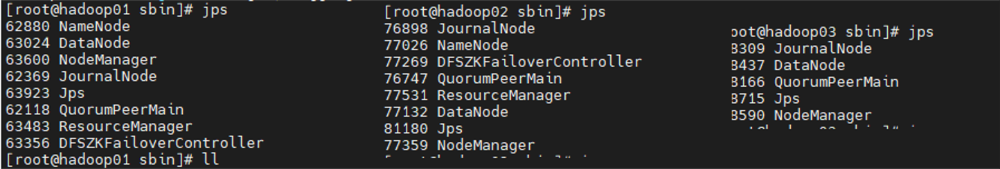


### 启动JobhistoryServer

```bash
[root@hadoop01 sbin]# ./mr-jobhistory-daemon.sh start historyserver
starting historyserver, logging to /usr/local/soft/hadoop-2.7.7/logs/mapred-root-historyserver-hadoop01.out

[root@hadoop01 sbin]# jps
21954 DataNode
28482 JobHistoryServer
20588 QuorumPeerMain
21804 NameNode
22609 NodeManager
3161 Jps
22299 DFSZKFailoverController
22492 JournalNode
```


## 测试

这里可以通过一下些简单的测试验证集群搭建是否成功，是否健康，比如通过http://IP:8088/cluster查看集群资源情况。

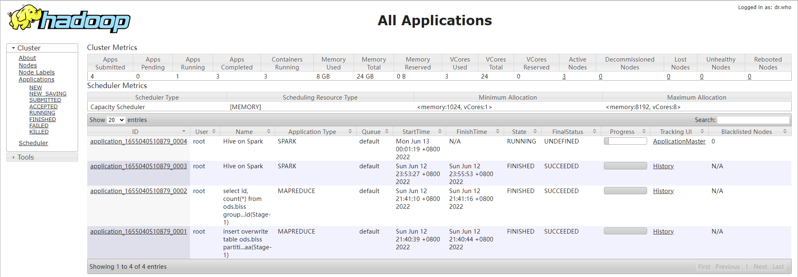


因为配置的是主备GA的集群，那么我们可以通过50070端口去查看集群NameNode主备状态是否与预想中的一致，一个是active状态一个是standby状态：http://IP:50070，那在控制台也可以通过命令行的方式去查看两个NN的状态：

```bash
# 任意一个节点都可以执行如下命令  
[root@hadoop02 sbin]# hdfs haadmin -getServiceState nn1
[root@hadoop02 sbin]# hdfs haadmin -getServiceState nn2
```

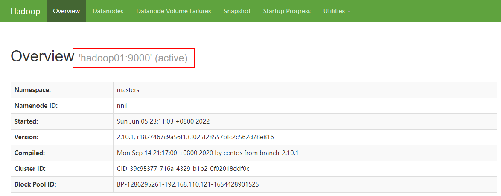

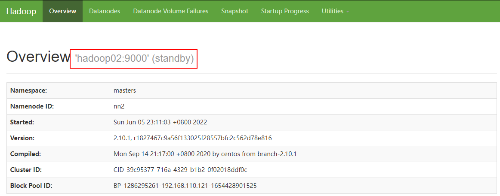

我们可以简单的验证高可用是否生效，我们当前hadoop01节点的NN是active状态，如果强制kill掉hadoop01节点的NN，那么处于standby状态的NN会立即接管集群将standby转为active状态，验证如下:


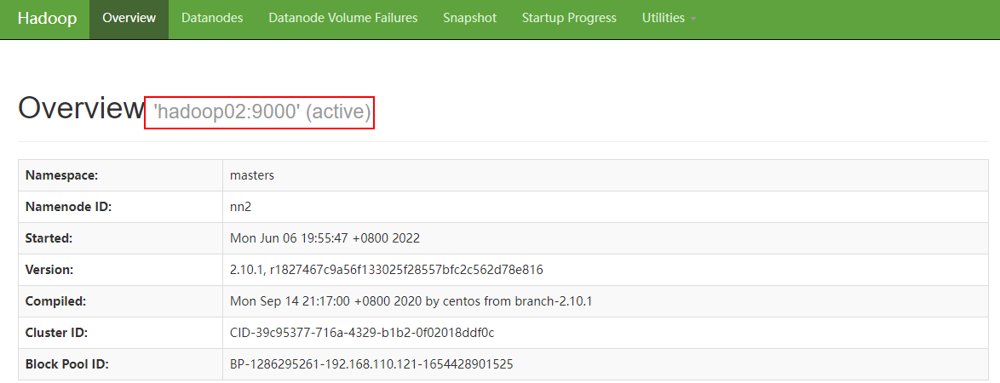


# MySQL环境配置

## 简介

MySQL是一个关系型数据库管理系统，由瑞典MySQL AB 公司开发，属于 Oracle 旗下产品。MySQL所使用的 SQL 语言是用于访问数据库的最常用标准化语言。MySQL 软件采用了双授权政策，分为社区版和商业版，由于其体积小、速度快、总体拥有成本低，尤其是开放源码这一特点，一般中小型和大型网站的开发都选择 MySQL 作为网站数据库。这里需要安装MySQL的原因是Hive的元数据存放需要一个关系型数据库作为存储元数据的媒介，MySQL和MariaDB都是不错的选择，鉴于MySQL的行业适用性更广，这里我们选择MySQL作为元数据库。


## 查看MySQL

```bash
# 检查系统中是否已经安装了MySQL  
[root@hadoop01 src]# rpm -qa|grep -i mysql  
mysql-5.1.47-4.el6.x86_64  
mysql-connector-odbc-5.1.5r1144-7.el6.x86_64  
mysql-libs-5.1.47-4.el6.x86_64  
mysql-devel-5.1.47-4.el6.x86_64  
mysql-server-5.1.47-4.el6.x86_64 
```


## 卸载MySQL、MariaDB

```bash
# 根据上面查询的结果将系统自带的MySQL卸载，安装自己需要的版本的MySQL，修改自己的配置信息 。
# 如果安装了那就卸载它使用如下命令 说明：-e参数表示删除 –nodeps表示不校验依赖关系,主要卸载内容一般包括以下包  
[root@hadoop01 src]# rpm -e --nodeps {上一步查询的MySQL安装包}

# 查询所有MySQL相关目录进行清除  
[root@hadoop01 src]# find / -name mysql 
```


## 下载MySQL

在[MySQL官网](https://downloads.mysql.com/archives/community/)找一个合适的MySQL版本tgz包进行下载，或者通过国内的镜像源进行下载，推荐使用[清华源](https://mirrors.tuna.tsinghua.edu.cn)；完成后上传至hadoop节点机中的一台，目前只需要一台安装MySQL即可（后续有需要可以做读写分离MySQL集群等）。

| [mysql-8.0.29-el7-x86_64.tar.gz](https://mirrors.tuna.tsinghua.edu.cn/mysql/downloads/MySQL-8.0/mysql-8.0.29-el7-x86_64.tar.gz) | 429.0 MiB | 2022-03-23 21:56 |
| ------------------------------------------------------------ | --------- | ---------------- |
|                                                              |           |                  |


## 安装MySQL

关于MySQL的安装配置可以参考[这篇文章](https://blog.csdn.net/weixin_42904118/article/details/122431022?utm_medium=distribute.pc_relevant.none-task-blog-2~default~baidujs_title~default-0-122431022-blog-108598713.pc_relevant_default&spm=1001.2101.3001.4242.1&utm_relevant_index=3)，以下仅做单节点部署的MySQL安装的简单介绍。

### 修改配置

```bash
# 将MySQL安装包上传至目标机器，解压，并移动到安装目录      
[root@hadoop02 src]# tar -zxvf mysql-8.0.29-el7-x86_64.tar.gz
  
# 修改文件夹名称      
[root@hadoop02 src]# mv mysql-8.0.29-el7-x86_64 mysql-8.0.29  
[root@hadoop02 src]# mv mysql-8.0.29 ../soft/
  
# 创建mysql数据存放目录，给安装目录赋予权限
[root@hadoop02 mysql-8.0.29]# mkdir databases
[root@hadoop02 mysql-8.0.29]# chmod 777 -R /usr/local/src/mysql-8.0.29
[root@hadoop02 mysql-8.0.29]# chmod 777 -R /usr/local/src/mysql-8.0.29/databases

# 创建mysql用户组
[root@hadoop02 soft]# groupadd mysql
# 创建mysql用户 添加到mysql用户组
[root@hadoop02 soft]# useradd -r -g mysql mysql
# 把刚刚创建的mysql用户加入到mysql组下
[root@hadoop02 soft]# chown -R mysql:mysql mysql-8.0.29
```

```bash
# 创建mysql安装初始化文件 加入以下配置保存*/
[root@hadoop02 soft]# vim /etc/my.cnf

[mysqld]
# 设置3306端口
port=3306
# 设置mysql的安装目录
basedir=/usr/local/soft/mysql-8.0.29
# 设置mysql数据库的数据的存放目录
datadir=/usr/local/soft/mysql-8.0.29/databases
# 允许最大连接数
max_connections=10000
# 允许连接失败的次数。这是为了防止有人从该主机试图攻击数据库系统
max_connect_errors=10
# 服务端使用的字符集默认为UTF8
character-set-server=utf8
# 创建新表时将使用的默认存储引擎
default-storage-engine=INNODB
# 默认使用“mysql_native_password”插件认证
default_authentication_plugin=mysql_native_password
[mysql]
# 设置mysql客户端默认字符集
default-character-set=utf8
[client]
# 设置mysql客户端连接服务端时默认使用的端口
port=3306
default-character-set=utf8
```


### 初始化

```bash
# 使用如下命令对mysql进行初始化 初始化之后的最后一行的root@localhost: 后面会打印root的初始密码： dsY,VGc+v5+l
[root@hadoop02 bin]# ./mysqld --initialize --console
2022-06-26T09:17:13.640599Z 0 [Warning] [MY-010918] [Server] 'default_authentication_plugin' is deprecated and will be removed in a future release. Please use authentication_policy instead.
2022-06-26T09:17:13.640613Z 0 [System] [MY-013169] [Server] /usr/local/soft/mysql-8.0.29/bin/mysqld (mysqld 8.0.29) initializing of server in progress as process 4693
2022-06-26T09:17:13.641828Z 0 [Warning] [MY-013242] [Server] --character-set-server: 'utf8' is currently an alias for the character set UTF8MB3, but will be an alias for UTF8MB4 in a future release. Please consider using UTF8MB4 in order to be unambiguous.
2022-06-26T09:17:13.656018Z 1 [System] [MY-013576] [InnoDB] InnoDB initialization has started.
2022-06-26T09:17:14.515008Z 1 [System] [MY-013577] [InnoDB] InnoDB initialization has ended.
2022-06-26T09:17:15.886175Z 6 [Note] [MY-010454] [Server] A temporary password is generated for root@localhost: dsY,VGc+v5+l

# 重新赋予权限
[root@hadoop02 support-files]# chmod -R 777 /usr/local/soft/mysql-8.0.29
```


### 启动MySQL

```bash
# 启动mysql
[root@hadoop02 support-files]# ./mysql.server start
Starting MySQL.Logging to '/usr/local/soft/mysql-8.0.29/databases/hadoop02.err'.
.. SUCCESS!
[root@hadoop02 support-files]#

# 将mysql加入到系统进程中
[root@hadoop02 support-files]# cp mysql.server /etc/init.d/mysqld

# 重启MySQL服务
[root@hadoop02 support-files]# service mysqld restart
Shutting down MySQL. SUCCESS!
Starting MySQL. SUCCESS!
[root@hadoop02 support-files]#

# 进入bin目录，启动MySQL客户端
[root@hadoop02 support-files]# cd ../bin
[root@hadoop02 bin]# ./mysql -uroot -p
Enter password:{使用上面初始化得到的密码}
Welcome to the MySQL monitor.  Commands end with ; or \g.
Your MySQL connection id is 8
Server version: 8.0.29

Copyright (c) 2000, 2022, Oracle and/or its affiliates.

Oracle is a registered trademark of Oracle Corporation and/or its
affiliates. Other names may be trademarks of their respective
owners.

Type 'help;' or '\h' for help. Type '\c' to clear the current input statement.

mysql>
```


### 更新密码

```mysql
# 重新设置root用户的密码为123456
mysql> alter user 'root'@'localhost' IDENTIFIED WITH mysql_native_password BY '123456';

# 进入mysql数据库
mysql> use mysql;
Reading table information for completion of table and column names
You can turn off this feature to get a quicker startup with -A

Database changed

# 修改用户访问权限 允许远程登录
mysql> update user set user.Host='%'where user.User='root';
Query OK, 1 row affected (0.00 sec)
Rows matched: 1  Changed: 1  Warnings: 0

# 刷新访问权限
mysql> flush privileges;
Query OK, 0 rows affected (0.00 sec)

# 退出 重启MySQL服务
mysql> quit;
```


### 环境变量

```bash
# 修改环境变量，添加MySQL环境变量，并强制刷新生效
[root@hadoop02 bin]# vim /etc/profile 
export MYSQL_HOME=/usr/local/soft/mysql-8.0.29
export PATH=.:${PATH}:${JAVA_HOME}/bin:${JRE_HOME}/bin:${ZOOKEEPER_HOME}/bin:${HADOOP_HOME}/bin:${SCALA_HOME}/bin:${SPARK_HOME}/bin:${MYSQL_HOME}/bin

# 刷新环境变量 
[root@hadoop01 conf]# source /etc/profile 

# 设置开机启动 mysql 这里的mysqld就是前面拷贝到/etc/init.d/mysqld的mysqld
[root@hadoop02 bin]# chkconfig --add mysqld
[root@hadoop02 bin]# chkconfig --level 2345 mysqld on
[root@hadoop02 bin]# chkconfig --list

Note: This output shows SysV services only and does not include native
      systemd services. SysV configuration data might be overridden by native
      systemd configuration.

      If you want to list systemd services use 'systemctl list-unit-files'.
      To see services enabled on particular target use
      'systemctl list-dependencies [target]'.

mysqld          0:off   1:off   2:on    3:on    4:on    5:on    6:off
netconsole      0:off   1:off   2:off   3:off   4:off   5:off   6:off
network         0:off   1:off   2:on    3:on    4:on    5:on    6:off
[root@hadoop02 bin]#
```


## 测试

我的Navicat到期了，这里使用DataGrip代替，连接测试正常，接下来就可以正常使用了。

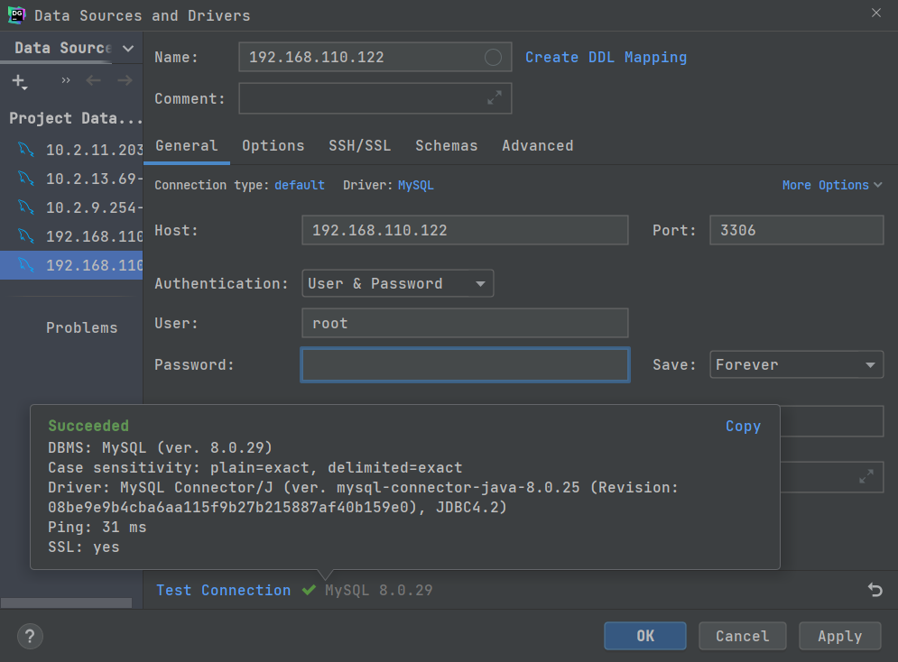


# Hive环境搭建

## 简介

Hive是基于Hadoop的一个数据仓库工具，用来进行数据提取、转化、加载，这是一种可以存储、查询和分析存储在Hadoop中的大规模数据的机制。hive数据仓库工具能将结构化的数据文件映射为一张数据库表，并提供SQL查询功能，能将SQL语句转变成MapReduce任务来执行。Hive的优点是学习成本低，可以通过类似SQL语句实现快速MapReduce统计，使MapReduce变得更加简单，而不必开发专门的MapReduce应用程序。Hive十分适合对数据仓库进行统计分析。


## 下载Hive

同样选择下载Apache Hive的时候我们可以选择[官网](https://www.apache.org/dyn/closer.cgi/hive/)下载也可以选择国内镜像（[清华源](https://mirrors.tuna.tsinghua.edu.cn/apache/hive/)）下载，区别在于官网有所有版本的Hive而国内的镜像只有部分版本提供。   

| [apache-hive-3.0.0-bin.tar.gz](https://archive.apache.org/dist/hive/hive-3.0.0/apache-hive-3.0.0-bin.tar.gz) | 2018-05-22 18:45 | 293M |
| ------------------------------------------------------------ | ---------------- | ---- |
|                                                              |                  |      |


## 配置Hive

### 添加Connector

Hive的元数据库是MySQL，所以我们还需要把mysql的驱动mysql-connector-java-8.0.29.jar上传至.../hive-3.0.0/lib目录下.

```bash
#防止直接修改出错，先将需要配置的文件复制一份再修改  
[root@hadoop02 conf]# cp hive-default.xml.template hive-default.xml
[root@hadoop02 conf]# cp hive-env.sh.template hive-env.sh
[root@hadoop02 conf]# cp hive-log4j2.properties.template hive-log4j.properties
[root@hadoop02 conf]# cp hive-default.xml hive-site.xml
```


### hive-env.sh

```bash
# Set HADOOP_HOME to point to a specific hadoop install directory
export HADOOP_HOME=/usr/local/soft/hadoop-2.7.7

# Hive Configuration Directory can be controlled by:
export HIVE_CONF_DIR=/usr/local/soft/hive-2.3.9/conf
```


### hive-log4j2.properties

```properties
property.hive.log.dir = /usr/local/soft/hive-3.0.0/logs
```


### hive-site.xml

```xml
<?xml version="1.0" encoding="UTF-8" standalone="no"?>
<?xml-stylesheet type="text/xsl" href="configuration.xsl"?>

<configuration>
    <property>
     <!-- 查询数据时 显示出列的名字 -->
        <name>hive.cli.print.header</name>
        <value>true</value>
    </property>
    <property>
     <!-- 在命令行中显示当前所使用的数据库 -->
        <name>hive.cli.print.current.db</name>
        <value>true</value>
    </property>
    <property>
     <!-- 默认数据仓库存储的位置，该位置为HDFS上的路径 -->
        <name>hive.metastore.warehouse.dir</name>
        <value>/user/hive/warehouse</value>
    </property>
    <!-- 8.x -->
    <property>
        <name>javax.jdo.option.ConnectionURL</name>
        <value>jdbc:mysql://hadoop02:3306/metastore?createDatabaseIfNotExist=true&amp;useSSL=false&amp;serverTimezone=GMT</value>
    </property>
    <!-- 8.x -->
    <property>
        <name>javax.jdo.option.ConnectionDriverName</name>
        <value>com.mysql.cj.jdbc.Driver</value>
    </property>
    <property>
        <name>javax.jdo.option.ConnectionUserName</name>
        <value>root</value>
    </property>
    <property>
        <name>javax.jdo.option.ConnectionPassword</name>
        <value>123456</value>
    </property>
</configuration>
```


### 配置环境变量

```bash
# 修改系统环境  
[root@hadoop02 conf]# vim /etc/profile  
export HIVE_HOME=/usr/local/soft/hive-3.0.0
export PATH=${PATH}:${JAVA_HOME}/bin:${JRE_HOME}/bin:${ZOOKEEPER_HOME}/bin:${HADOOP_HOME}/bin:${SCALA_HOME}/bin:${SPARK_HOME}/bin:${MYSQL_HOME}/bin:${HIVE_HOME}/bin


# 记得刷新环境变量
[root@hadoop02 conf]# source /etc/profile
```


### 初始化元数据库

```bash
# 以上配置完成后，需要初始化mysql元数据库，所谓初始化就是在mysql中创建hive的元数据库也就是我们配置在javax.jdo.option.ConnectionURL的metastore，使用如下命令进行配置：
[root@hadoop01 bin]# ./schematool -dbType mysql -initSchema root 123456 --verbose
```

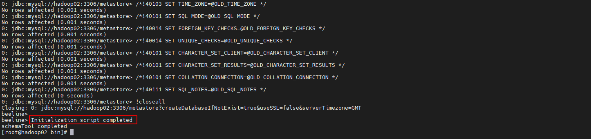


## 启动Hive

### 启动元数据服务

```bash
[root@hadoop02 bin]# nohup hive --service metastore &
[root@hadoop02 bin]# nohup hive --service hiveserver2 &

# 两个RunJar的Java进程就是刚刚启动的元年数据服务
[root@hadoop02 bin]# jps
15633 JournalNode
16353 Worker
15907 NodeManager
15800 DFSZKFailoverController
15225 QuorumPeerMain
16489 RunJar
19610 Jps
15515 DataNode
15420 NameNode
16605 RunJar
```


## 测试

进入hive客户端测试Hive的功能，验证如下CRUD的功能是否正常，如果正常则表示Hive环境搭建成功。到此Hive可以通过Hive Cli / beeline cli/ Java JDBC的方式进行连接（可以自己验证）。

```bash
[root@hadoop02 bin]# hive
...
Logging initialized using configuration in jar:file:/usr/local/soft/hive-3.0.0/lib/hive-common-3.0.0.jar!/hive-log4j2.properties Async: true
Hive-on-MR is deprecated in Hive 2 and may not be available in the future versions. Consider using a different execution engine (i.e. spark, tez) or using Hive 1.X releases.
hive (default)> set hive.execution.engine;
hive.execution.engine=mr
hive (default)> show databases;
OK
database_name
default
Time taken: 0.431 seconds, Fetched: 1 row(s)

# 创建数据库
hive (default)> create database ods;
OK
Time taken: 0.104 seconds

# 创建表
hive (default)> create table if not exists ods.biss(
              >     id string,
              >     code string
              > )partitioned by(`dt` string)
              > ;
OK
Time taken: 0.179 seconds

# 插入数据，会启动MR服务
hive (default)> insert overwrite table ods.biss partition(dt=202206011505)
              > select * from (
              > select '1' as id , 'jia001' as code
              > union all
              > select '2' as id , 'xia002' as code
              > union all
              > select '3' as id , 'tia003' as code
              > ) aa;
Query ID = root_20220626193550_93a49457-9fb5-49e2-9390-c5835f12a194
Total jobs = 3
Launching Job 1 out of 3
Number of reduce tasks not specified. Estimated from input data size: 1
In order to change the average load for a reducer (in bytes):
  set hive.exec.reducers.bytes.per.reducer=<number>
In order to limit the maximum number of reducers:
  set hive.exec.reducers.max=<number>
In order to set a constant number of reducers:
  set mapreduce.job.reduces=<number>
Starting Job = job_1656243011117_0001, Tracking URL = http://hadoop01:8088/proxy/application_1656243011117_0001/
Kill Command = /usr/local/soft/hadoop-2.7.7/bin/mapred job  -kill job_1656243011117_0001
Hadoop job information for Stage-1: number of mappers: 1; number of reducers: 1
2022-06-26 19:36:01,999 Stage-1 map = 0%,  reduce = 0%
2022-06-26 19:36:03,052 Stage-1 map = 100%,  reduce = 100%, Cumulative CPU 3.68 sec
MapReduce Total cumulative CPU time: 3 seconds 680 msec
Ended Job = job_1656243011117_0001
Stage-4 is selected by condition resolver.
Stage-3 is filtered out by condition resolver.
Stage-5 is filtered out by condition resolver.
Moving data to directory hdfs://masters/user/hive/warehouse/ods.db/biss/dt=202206011505/.hive-staging_hive_2022-06-26_19-35-50_897_1139040472351276912-1/-ext-10000
Loading data to table ods.biss partition (dt=202206011505)
MapReduce Jobs Launched:
Stage-Stage-1: Map: 1  Reduce: 1   Cumulative CPU: 3.68 sec   HDFS Read: 23432 HDFS Write: 564526 SUCCESS
Total MapReduce CPU Time Spent: 3 seconds 680 msec
OK
aa.id   aa.code
Time taken: 14.03 seconds

# 查询数据，回启动MR计算
hive (default)> select id, count(*) from ods.biss group by id ;
Query ID = root_20220626193611_260d52b7-8134-46f4-94c4-26efc31f8847
Total jobs = 1
Launching Job 1 out of 1
Number of reduce tasks not specified. Estimated from input data size: 1
In order to change the average load for a reducer (in bytes):
  set hive.exec.reducers.bytes.per.reducer=<number>
In order to limit the maximum number of reducers:
  set hive.exec.reducers.max=<number>
In order to set a constant number of reducers:
  set mapreduce.job.reduces=<number>
Starting Job = job_1656243011117_0002, Tracking URL = http://hadoop01:8088/proxy/application_1656243011117_0002/
Kill Command = /usr/local/soft/hadoop-2.7.7/bin/mapred job  -kill job_1656243011117_0002
Hadoop job information for Stage-1: number of mappers: 1; number of reducers: 1
2022-06-26 19:36:21,062 Stage-1 map = 0%,  reduce = 0%
2022-06-26 19:36:22,124 Stage-1 map = 100%,  reduce = 100%, Cumulative CPU 6.7 sec
MapReduce Total cumulative CPU time: 6 seconds 700 msec
Ended Job = job_1656243011117_0002
MapReduce Jobs Launched:
Stage-Stage-1: Map: 1  Reduce: 1   Cumulative CPU: 6.7 sec   HDFS Read: 19564 HDFS Write: 556130 SUCCESS
Total MapReduce CPU Time Spent: 6 seconds 700 msec
OK
id      _c1
1       1
2       1
3       1
Time taken: 12.494 seconds, Fetched: 3 row(s)
```


# Scala环境配置

## 简介

Scala 是一门多范式（multi-paradigm）的编程语言，设计初衷是要集成面向对象编程和函数式编程的各种特性。Scala 运行在Java虚拟机上，并兼容现有的Java程序。Scala 源代码被编译成Java字节码，所以它可以运行于**JVM**之上，并可以调用现有的Java类库。运行在JVM之上说明Scala运行依赖Java,所以在安装Scala之前需要安装Java,如果没有安装Java请移步**Java环境配置**


## 下载Scala

在[Scala官网](https://www.scala-lang.org/download/2.11.12.html)下载合适的版本,Linux下的安装包可以选择wget的方式下载,也可以在本地下载后上传,建议本地下载后上传,这样本地的安装包可以保留下一次接着安装在其他机器,而不用重复下载.

| [scala-2.11.12.tgz](https://downloads.lightbend.com/scala/2.11.12/scala-2.11.12.tgz) | Mac OS X, Unix, Cygwin | 27.77M |
| ------------------------------------------------------------ | ---------------------- | ------ |
|                                                              |                        |        |


## 配置Scala

```bash
# 将Scala安装包解压
[root@hadoop01 src]# tar -zxvf scala-2.11.12.tgz

# 移动到soft安装目录下,统一管理
[root@hadoop01 src]# mv scala-2.11.12 ../soft/

# 修改配置环境变量
[root@hadoop01 soft]# vim /etc/profile
export SCALA_HOME=/usr/local/soft/scala-2.11.12
export PATH=.:${PATH}:${JAVA_HOME}/bin:${JRE_HOME}/bin:${ZOOKEEPER_HOME}/bin:${HADOOP_HOME}/bin:$MYSQL_HOME/bin:${HIVE_HOME}/bin:$SCAL_HOME/bin

# 及时刷新环境变量,使其立即生效
[root@hadoop01 soft]# source /etc/profile
```


## 测试

```bash
[root@hadoop01 soft]# scala -version
Scala code runner version 2.11.12 -- Copyright 2002-2017, LAMP/EPFL
```


# Spark环境搭建（Hive-On-Spark）

## 简介

这里我们选择Spark-2.0.0版本是因为当前Hive的执行引擎是MR，如果后需需要替换MR为Spark计算引擎，我们就可以直接使用当前安装的Spark版本，关于Spark版本与Hive版本的对应关系可以参考如下：Hive on Spark is only tested with a specific version of Spark, so a given version of Hive is only guaranteed to work with a specific version of Spark. Other versions of Spark may work with a given version of Hive, but that is not guaranteed. Below is a list of Hive versions and their corresponding compatible Spark versions.

| Hive Version | Spark Version |
| :----------- | :------------ |
| master       | 2.3.0         |
| 3.0.x        | 2.3.0         |
| 2.3.x        | 2.0.0         |
| 2.2.x        | 1.6.0         |
| 2.1.x        | 1.6.0         |
| 2.0.x        | 1.5.0         |
| 1.2.x        | 1.3.1         |
| 1.1.x        | 1.2.0         |

因为Hadoop体系的生态要比Spark更丰富基于Hive的可扩展性要优于当前的Spark社区，即便Spark On Hive的速度更快，所以我们选择Hive On Spark。


## 下载软件

因为Hive支持的Spark版本跨度较大，因此我们在选择的时候需要按照上面的表格来选择，不能随意更改，当前Hive版本与Hadoop版本是一致的，如果选择更换版本还要考虑Hadoop与Hive的适配性，所以照着来就行。在[Spark官网](https://archive.apache.org/dist/spark/spark-2.3.0/)下载如下spark-2.0.0.tgz版本的源码包，我们需要自己[编译](https://blog.csdn.net/ghl0451/article/details/103956069)一个不带Hive模块的Spark绿色版本，编译时间比较长，如果不想自己动手编译可以选择使用我已经编译好的[Spark包](https://drive.weixin.qq.com/s?k=AC4AjgdVAAcYoNwRY6)。

| [spark-2.3.0.tgz](https://archive.apache.org/dist/spark/spark-2.3.0/spark-2.3.0.tgz) | 2018-02-22 19:54 | 29M  |
| ------------------------------------------------------------ | ---------------- | ---- |
|                                                              |                  |      |


## 配置修改

### hive-site.xml

在原有的配置基础上增加以下配置：

```xml
    <property>
        <name>hive.execution.engine</name>
        <value>mr</value>
    </property>
    <property>
        <name>hive.enable.spark.execution.engine</name>
        <value>true</value>
    </property>
    <property>
        <name>spark.home</name>
        <value>/usr/local/soft/spark-2.3.0</value>
    </property>
    <property>
        <name>spark.master</name>
        <value>yarn</value>
    </property>
    <property>
        <name>spark.eventLog.enabled</name>
        <value>true</value>
    </property>
    <property>
        <name>spark.eventLog.dir</name>
        <value>hdfs://masters/spark-hive-jobhistory</value>
    </property>
    <property>
        <name>spark.executor.memory</name>
        <value>2048m</value>
    </property>
    <property>
        <name>spark.driver.memory</name>
        <value>1024m</value>
    </property>
    <property>
        <name>spark.serializer</name>
        <value>org.apache.spark.serializer.KryoSerializer</value>
    </property>
    <property>
        <name>spark.yarn.jars</name>
        <value>hdfs://masters/spark-jars/*</value>
    </property>
    <property>
        <name>hive.spark.client.server.connect.timeout</name>
        <value>300000</value>
    </property>
```


### spark-env.sh

```bash
# 在spark安装包的根目录下新建文件夹
[root@hadoop02 spark-2.3.0]# mkdir pids

export SPARK_PID_DIR=/usr/local/soft/spark-2.3.0/pids
export JAVA_HOME=/usr/local/soft/jdk1.8.0_333
export SCALA_HOME=/usr/local/soft/scala-2.11.12
export HADOOP_HOME=/usr/local/soft/hadoop-2.7.7
export HADOOP_CONF_DIR=/usr/local/soft/hadoop-2.7.7/etc/hadoop
export HADOOP_YARN_CONF_DIR=/usr/local/soft/hadoop-2.7.7/etc/hadoop
export SPARK_HOME=/usr/local/soft/spark-2.3.0
export SPARK_WORKER_MEMORY=2048m
export SPARK_EXECUTOR_MEMORY=2048m
export SPARK_DRIVER_MEMORY=1024m
export SPARK_DIST_CLASSPATH=$(/usr/local/soft/hadoop-2.7.7/bin/hadoop classpath)
export SPARK_DAEMON_JAVA_OPTS="-Dspark.deploy.recoveryMode=ZOOKEEPER -Dspark.deploy.zookeeper.url=hadoop01:2181,hadoop02:2181,hadoop03:2181 -Dspark.deploy.zookeeper.dir=/ha-on-spark"
```


### slaves

```bash
# A Spark Worker will be started on each of the machines listed below.

hadoop01
hadoop02
hadoop03
```

### 拷贝jar包

```bash
# 将Hive的lib目录下的指定jar包拷贝到Spark的jars目录下：
hive-beeline
hive-cli
hive-exec
hive-jdbc
hive-metastore
  
[root@hadoop02 lib]# cp hive-beeline-3.0.0.jar hive-cli-3.0.0.jar hive-exec-3.0.0.jar hive-jdbc-3.0.0.jar hive-metastore-3.0.0.jar /usr/local/soft/spark-2.3.0/jars/
```

```bash
# 将Spark的jars目录下的指定jar包拷贝到Hive的lib目录下：
spark-network-common
spark-core_
chill-java
chill
jackson-module-paranamer
jackson-module-scala
jersey-container-servlet-core
jersey-server
json4s-ast
kryo-shaded
minlog
scala-xml
spark-launcher
spark-network-shuffle
spark-unsafe
xbean-asm5-shaded

[root@hadoop02 jars]# cp spark-network-common_2.11-2.3.0.jar spark-core_2.11-2.3.0.jar scala-library-2.11.8.jar chill-java-0.8.4.jar chill_2.11-0.8.4.jar jackson-module-paranamer-2.7.9.jar jackson-module-scala_2.11-2.6.7.1.jar jersey-container-servlet-core-2.22.2.jar jersey-server-2.22.2.jar json4s-ast_2.11-3.2.11.jar kryo-shaded-3.0.3.jar minlog-1.3.0.jar scala-xml_2.11-1.0.5.jar spark-launcher_2.11-2.3.0.jar spark-network-shuffle_2.11-2.3.0.jar spark-unsafe_2.11-2.3.0.jar xbean-asm5-shaded-4.4.jar /usr/local/soft/hive-3.0.0/lib/
```

```bash
# 将hadoop中的yarn-site.xml、hdfs-site.xml以及Hive的hive-site.xml放入spark的conf中
[root@hadoop02 soft]# cp hadoop-2.7.7/etc/hadoop/hdfs-site.xml spark-2.3.0/conf/
[root@hadoop02 soft]# cp hadoop-2.7.7/etc/hadoop/yarn-site.xml spark-2.3.0/conf/
[root@hadoop02 soft]# cp hive-3.0.0/conf/hive-site.xml spark-2.3.0/conf/
```


为了使各个节点都能够使用 Spark 引擎进行计算，需要将Spark的jars目录下所有依赖包上传至HDFS

```bash
[root@hadoop02 spark-2.3.0]# hdfs dfs -mkdir /spark-jars
[root@hadoop02 spark-2.3.0]# hdfs dfs -mkdir /spark-hive-jobhistory
[root@hadoop02 jars]# pwd
/usr/local/soft/spark-2.3.0/jars
[root@hadoop01 jars]# hdfs dfs -put *.jar /spark-jars
```

将Spark安装包分发至每个节点

```bash
[root@hadoop02 soft]# scp -r spark-2.3.0 root@hadoop01:/usr/local/soft/
[root@hadoop02 soft]# scp -r spark-2.3.0 root@hadoop03:/usr/local/soft/
```

### 配置环境变量

```bash
# 修改每一个节点的环境变量
export SPARK_HOME=/usr/local/soft/spark-2.3.0
export PATH=.:${PATH}:${JAVA_HOME}/bin:${JRE_HOME}/bin:${ZOOKEEPER_HOME}/bin:${HADOOP_HOME}/bin:$MYSQL_HOME/bin:${HIVE_HOME}/bin:$SCAL_HOME/bin:${SPARK_HOME}/bin
```


## 启动集群

```bash
# 在hadoop01上启动spark集群
[root@hadoop01 sbin]# ./start-all.sh
[root@hadoop01 sbin]# ./start-all.sh
starting org.apache.spark.deploy.master.Master, logging to /usr/local/soft/spark-2.3.0/logs/spark-root-org.apache.spark.deploy.master.Master-1-hadoop01.out
hadoop01: starting org.apache.spark.deploy.worker.Worker, logging to /usr/local/soft/spark-2.3.0/logs/spark-root-org.apache.spark.deploy.worker.Worker-1-hadoop01.out
hadoop03: starting org.apache.spark.deploy.worker.Worker, logging to /usr/local/soft/spark-2.3.0/logs/spark-root-org.apache.spark.deploy.worker.Worker-1-hadoop03.out
hadoop02: starting org.apache.spark.deploy.worker.Worker, logging to /usr/local/soft/spark-2.3.0/logs/spark-root-org.apache.spark.deploy.worker.Worker-1-hadoop02.out

# 在hadoop02上启动备Master
[root@hadoop02 sbin]# ./start-master.sh
starting org.apache.spark.deploy.master.Master, logging to /usr/local/soft/spark-2.3.0/logs/spark-root-org.apache.spark.deploy.master.Master-1-hadoop02.out
```


## 测试

```bash
# 重新启动hive的元数据服务
[root@hadoop01 bin]# nohup hive --service metastore &
# 重新启动hs2服务  
[root@hadoop01 bin]# nohup hive --service hiveserver2 &
```

```bash
-- 执行一个稍显复杂的SQL语句，会看到底层的执行引擎信息
select id, count(*) from ods.biss group by id;

# 因为默认的执行引擎我们配置的是mr(详见：hive-site.xml->hive.execution.engine),所以为了验证spark
# 在hive客户端的当前session中临时set一下spark
hive (default)> set hive.execution.engine=spark;
hive (default)> select id, count(*) from ods.biss group by id;
Query ID = root_20220626193844_0504e078-5834-4ee2-9110-83c08ff6dd03
Total jobs = 1
Launching Job 1 out of 1
In order to change the average load for a reducer (in bytes):
  set hive.exec.reducers.bytes.per.reducer=<number>
In order to limit the maximum number of reducers:
  set hive.exec.reducers.max=<number>
In order to set a constant number of reducers:
  set mapreduce.job.reduces=<number>
--------------------------------------------------------------------------------------
          STAGES   ATTEMPT        STATUS  TOTAL  COMPLETED  RUNNING  PENDING  FAILED
--------------------------------------------------------------------------------------
Stage-2 ........         0      FINISHED      1          1        0        0       0
Stage-3 ........         0      FINISHED      2          2        0        0       0
--------------------------------------------------------------------------------------
STAGES: 02/02    [==========================>>] 100%  ELAPSED TIME: 1.01 s
--------------------------------------------------------------------------------------
# 可以看到这里的执行引擎已经切换到spark了，运行时间1.01 s
Spark job[1] finished successfully in 1.01 second(s)
OK
id      _c1
3       1
1       1
2       1
Time taken: 1.239 seconds, Fetched: 3 row(s)
hive (default)>
```

