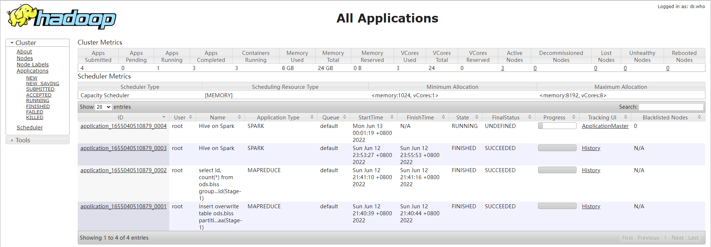
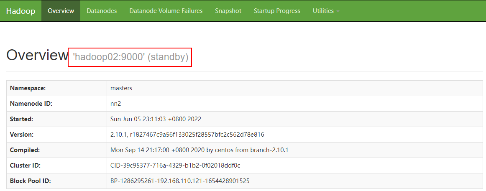

# 集群环境搭建指南

## 集群资源介绍

搭建Hadoop高可用环境至少准备三台节点机，在其中两个节点部署NameNode服务，以保证HDFS的高可用，在两台机器上部署ResourceManager服务，以保证Yarn的高可用性，DataNode需要部署三个节点（生产环境通常与NameNode隔离，这里就不做拆分了），充分利用集群资源，JournalNode是一个可独立配置的集群，用于NameNode主备数据同步，Zookeeper作为分布式锁服务用于双NameNode竞选主服务，Hive是建立在Hadoop环境上的数据仓库，用于提供类SQL服务执行MR任务，Spark号称是下一代MR计算引擎，他拥有更快的计算速度，不亚于MR的吞吐能力能等优点，但基于多线程模式的Spark计算引擎，其稳定性要低于基于多进程模式的MapReduce计算框架。

| 服务器   | NameNode | DataNode | ResourceManager | NodeManager | JournalNode | Zookeeper | ZKFC | Hive | Spark-Master | Spark-slaves |
| -------- | -------- | -------- | --------------- | ----------- | ----------- | --------- | ---- | ---- | ------------ | ------------ |
| hadoop01 | √        | √        | √               | √           | √           | √         | √    | √    | √            |              |
| hadoop02 | √        | √        | √               | √           | √           | √         | √    |      |              | √            |
| hadoop03 |          | √        |                 | √           | √           | √         |      |      |              | √            |

## 软件版本介绍

| Java      | jdk-8u333-linux-x64.tar.gz               | jdk1.8即可                                                   |
| --------- | ---------------------------------------- | ------------------------------------------------------------ |
| Zookeeper | zookeeper-3.8.0.tar.gz                   | 只要是3.8版本即可                                            |
| Hadoop    | hadoop-3.3.3.tar.gz                      | Hadoop选用3.3.3是3.X系列最新版本，后续版本还会继续升级       |
| MySQL     | mysql-8.0.29-el7-x86_64.tar.gz           | mysql-8.0.29版本                                             |
| Hive      | apache-hive-3.1.3-bin.tar.gz             | Hive的版本需要与Hadoop的大版本保持一致                       |
| Scala     | scala-2.11.12.tgz                        | 需要根据自己的环境和Spark相对应                              |
| Spark     | spark-2.4.8-bin-hadoop3-without-hive.tgz | Spark版本与Hadoop大版本保持一致，选用特殊版本，自己编译不带Hive模块的spark |


# 前置系统环境配置

关于Linux系统安装克隆，Java环境配置，Linux环境配置可以参考 [2.3.0](../2.3.0/虚拟机环境搭建教程(DEV).md) 版本的虚拟机环境搭建，这里不再赘述。


# Zookeeper集群搭建

## 简介

ZooKeeper是一个[分布式](https://baike.baidu.com/item/分布式/19276232)的，开放源码的[分布式应用程序](https://baike.baidu.com/item/分布式应用程序/9854429)协调服务，是[Google](https://baike.baidu.com/item/Google)的Chubby一个[开源](https://baike.baidu.com/item/开源/246339)的实现，是Hadoop和[Hbase](https://baike.baidu.com/item/Hbase/7670213)的重要组件。它是一个为分布式应用提供一致性服务的软件，提供的功能包括：配置维护、域名服务、分布式同步、组服务等。ZooKeeper的目标就是封装好复杂易出错的关键服务，将简单易用的接口和性能高效、功能稳定的系统提供给用户。ZooKeeper包含一个简单的原语集，提供Java和C的接口。ZooKeeper代码版本中，提供了分布式独享锁、选举、队列的接口，代码在$ZOOKEEPER_HOOOME\src\recipes。其中分布锁和队列有[Java](https://baike.baidu.com/item/Java/85979)和C两个版本，选举只有Java版本。

## 下载软件

Zookeeper下载可以在[Zookeeper官网](https://zookeeper.apache.org/releases.html#download)找到合适的版本。最新版本以及最近的几个版本可以在[清华源](https://mirrors.tuna.tsinghua.edu.cn/apache/zookeeper/)、[科大源](https://mirrors.ustc.edu.cn/apache/zookeeper/)等国内镜像中下载，但历史版本还是需要去Apache下载，在Download下**Older releases are available [in the archive](https://archive.apache.org/dist/zookeeper/)**.。

| [zookeeper-3.8.0](https://archive.apache.org/dist/zookeeper/zookeeper-3.8.0) | 2020-02-14 12:32 | -    |
| ------------------------------------------------------------ | ---------------- | ---- |
|                                                              |                  |      |

## 修改配置

```bash
# 将下载好的安装包解压
[root@hadoop01 src]# tar -zxvf apache-zookeeper-3.8.0-bin.tar.gz
# 修改名字然后mv到目标安装目录中
[root@hadoop01 src]# mv apache-zookeeper-3.8.0-bin.tar.gz  zookeeper-3.8.0
[root@hadoop01 src]# mv zookeeper-3.8.0 ../soft/

# 进入到zookeeper-3.8.0目录下创建两个文件夹data和log
[root@hadoop01 zookeeper-3.8.0]# mkdir data
[root@hadoop01 zookeeper-3.8.0]# mkdir logs

# 然后进入conf目录修改配置信息  
[root@hadoop01 zookeeper-3.8.0]# cd conf
[root@hadoop01 conf]# mv zoo_sample.cfg zoo.cfg

# 修改配置zoo.cfg
[root@hadoop01 conf]# vim zoo.cfg
dataDir=/usr/local/soft/zookeeper-3.8.0/data
dataLogDir=/usr/local/soft/zookeeper-3.8.0/logs

#autopurge.purgeInterval=1
server.1=hadoop01:2888:3888
server.2=hadoop02:2888:3888
server.3=hadoop03:2888:3888
```

增加环境变量的配置信息，配置完成后强制刷新配置文件，修改环境变量 

```bash
[root@hadoop01 conf]# vim /etc/profile
export ZOOKEEPER_HOME=/usr/local/soft/zookeeper-3.8.0
export PATH=.:${PATH}:${JAVA_HOME}/bin:${JRE_HOME}/bin:$ZOOKEEPER_HOME/bin
# 刷新环境变量 
[root@hadoop01 conf]# source /etc/profile
```

完成后将hadoop01节点已经完成配置的zookeeper-3.8.0安装包分别分发复制到hadoop02和hadoop03节点的软件安装目录/usr/local/soft/下

```bash
[root@hadoop01 soft]# scp -r zookeeper-3.8.0 root@hadoop02:/usr/local/soft/
[root@hadoop01 soft]# scp -r zookeeper-3.8.0 root@hadoop03:/usr/local/soft/
```

在/usr/local/soft/zookeeper-3.8.0/data/目录下，创建文件myid，同时修改各节点myid的值，使用如下命令分别在三个节点快速创建修改三台机器的myid文件

```bash
[root@hadoop01 soft]# echo "1" > /usr/local/soft/zookeeper-3.8.0/data/myid
[root@hadoop02 soft]# echo "2" > /usr/local/soft/zookeeper-3.8.0/data/myid
[root@hadoop03 soft]# echo "3" > /usr/local/soft/zookeeper-3.8.0/data/myid
```

## 启停服务

```bash
# 启动Zookeeper
[root@hadoop01 soft]# zkServer.sh start
ZooKeeper JMX enabled by default
Using config: /usr/local/soft/zookeeper-3.8.0/bin/../conf/zoo.cfg
Starting zookeeper ... STARTED

# 停止Zookeeper
[root@hadoop01 soft]# zkServer.sh stop
ZooKeeper JMX enabled by default
Using config: /usr/local/soft/zookeeper-3.8.0/bin/../conf/zoo.cfg
Stopping zookeeper ... STOPPED

# 查看当前Zookeeper服务状态
[root@hadoop01 soft]# zkServer.sh status
ZooKeeper JMX enabled by default
Using config: /usr/local/soft/zookeeper-3.8.0/bin/../conf/zoo.cfg
Client port found: 2181. Client address: localhost. Client SSL: false.
Mode: follower

# jps命令查看刚刚启动的zookeeper服务：QuorumPeerMain
[root@hadoop01 bin]# jps
9297 QuorumPeerMain
9416 Jps
```

## 启动集群

ZK的集群启动非常简单，只需要在三个节点挨个儿执行启动命令即可，然后查看每个节点启动是否正常，jps查看各节点ZK的主程序是否存活即可，通常没有报错就不会有问题，ZK集群是整个Hadoop集群环境系列搭建最简单的。当然ZK还提供了非常丰富的功能，需要的小伙伴可以自行查看学习使用。

## 补充一: 一键启停

ZK本身不提供一键启动所有节点服务的启动脚本，我们可以自己安排一个，具体的代码示例如下，参考实现:

```bash
# 一键启动
# zkStart-all.sh
# start zk cluster
for host in hadoop01 hadoop02 hadoop03
do
        echo "===========start zk cluster :$host==============="
        ssh  $host 'source /etc/profile; /usr/local/soft/zookeeper-3.8.0/bin/zkServer.sh start'
done
sleep 3s
#check status
for host in hadoop01 hadoop02 hadoop03
do
        echo "===========checking zk node status :$host==============="
        ssh  $host 'source /etc/profile; /usr/local/soft/zookeeper-3.8.0/bin/zkServer.sh status'
done

```

```bash
# 一键停机
# zkStop-all.sh
# stop zk cluster
for host in hadoop01 hadoop02 hadoop03
do
        echo "===========$host==============="
        ssh  $host 'source /etc/profile; /usr/local/soft/zookeeper-3.8.0/bin/zkServer.sh stop'
done

```

## 补充二: 服务启动失败，端口被占用

这种情况比较少见，通常跟用户的权限有关，ZK服务启动无异常，JPS不显示QuorumPeerMain服务进程，但查看2181端口显示已经被绑定，处理办法比较简单，kill掉绑定该端口的java进程，重新启动ZK就可以了，这里的java进程实际上就是QuorumPeerMain进程。


# Hadoop-HA集群搭建

## 简介

Hadoop是一个由Apache基金会所开发的[分布式系统](https://baike.baidu.com/item/分布式系统/4905336)基础架构。用户可以在不了解分布式底层细节的情况下，开发分布式程序。充分利用集群的威力进行高速运算和存储。Hadoop实现了一个[分布式文件系统](https://baike.baidu.com/item/分布式文件系统/1250388)（ Distributed File System），其中一个组件是[HDFS](https://baike.baidu.com/item/HDFS/4836121)（Hadoop Distributed File System）。HDFS有高[容错性](https://baike.baidu.com/item/容错性/9131391)的特点，并且设计用来部署在低廉的（low-cost）硬件上；而且它提供高吞吐量（high throughput）来访问[应用程序](https://baike.baidu.com/item/应用程序/5985445)的数据，适合那些有着超大数据集（large data set）的应用程序。HDFS放宽了（relax）[POSIX](https://baike.baidu.com/item/POSIX/3792413)的要求，可以以流的形式访问（streaming access）文件系统中的数据。Hadoop的框架最核心的设计就是：[HDFS](https://baike.baidu.com/item/HDFS/4836121)和[MapReduce](https://baike.baidu.com/item/MapReduce/133425)。HDFS为海量的数据提供了存储，而MapReduce则为海量的数据提供了计算。

## 下载软件

Hadoop官网[下载](https://archive.apache.org/dist/hadoop/common/)链接,这里再推荐一个[腾讯源](https://mirrors.cloud.tencent.com/apache/hadoop/core/hadoop-2.10.1/)下载地址,速度快很多,可以下载自己需要的版本,这里选取的是Hadoop-3.3.3,也是Hadoop3.3.x系列当前最新的一个版本，本次环境搭建不限于3.3.x，更加推荐的版本是3.1.x系列。

## 修改配置

**注：接下来的配置在适应不同的组件时还需要做其他修改优化，当前只做简单的配置完成基本的高可用集群环境的搭建。**

```bash
# 将/usr/local/src/ 目录下的hadoop安装包解压修改名称后移动至/usr/local/soft/目录下
[root@hadoop01 src]# tar -zxvf hadoop-3.3.3.tar.gz
[root@hadoop01 src]# mv hadoop-3.3.3 ../soft/
[root@hadoop01 src]# cd .../soft/ 
[root@hadoop01 soft]# cd hadoop-3.3.3

# 在hadoop安装包的根目录下新建如下文件夹
[root@hadoop01 hadoop-3.3.3]# mkdir -p tmp
[root@hadoop01 hadoop-3.3.3]# mkdir -p logs
[root@hadoop01 hadoop-3.3.3]# mkdir -p dfs/data/journalnode
[root@hadoop01 hadoop-3.3.3]# mkdir -p dfs/edits
[root@hadoop01 hadoop-3.3.3]# mkdir -p dfs/data/datanode
[root@hadoop01 hadoop-3.3.3]# mkdir -p dfs/data/namenode

# 进入配置目录,修改配置文件
[root@hadoop01 hadoop-3.3.3]# cd /usr/local/soft/hadoop-3.3.3/etc/hadoop
```

### hadoop_env.sh

```bash
# 如果下面的环境变量不生效，请移步配置在/etc/profile中
export HDFS_NAMENODE_USER=root
export HDFS_DATANODE_USER=root
export HDFS_JOURNALNODE_USER=root
export HDFS_SECONDARYNAMENODE_USER=root
export YARN_RESOURCEMANAGER_USER=root
export YARN_NODEMANAGER_USER=root
export HDFS_ZKFC_USER=root

# 修改hadoop_env.sh启动环境变量，Hadoop独立配置。
export JAVA_HOME=/usr/local/soft/jdk1.8.0_333
export HADOOP_CONF_DIR=/usr/local/soft/hadoop-3.3.3/etc/hadoop
```

### core-site.xml

```xml
<configuration>
    <property>
          <name>fs.defaultFS</name>
          <value>hdfs://masters</value>
    </property>
    <property>
          <name>hadoop.tmp.dir</name>
          <value>/usr/local/soft/hadoop-3.3.3/tmp</value>
    </property>
    <property>
           <name>ha.zookeeper.quorum</name>
           <value>hadoop01:2181,hadoop02:2181,hadoop03:2181</value>
    </property>
    <property>
        <!--设置缓存大小，默认4kb-->
        <name>io.file.buffer.size</name>
        <value>4096</value>
    </property>
    <property>
        <name>hadoop.proxyuser.root.hosts</name>
        <value>*</value>
    </property>
    <property>
        <name>hadoop.proxyuser.root.groups</name>
        <value>*</value>
    </property>
</configuration>
```

### hdfs-site.xml

```bash
# 在hadoop安装包的根目录下新建如下文件夹
[root@hadoop01 hadoop-3.3.3]# mkdir -p tmp
[root@hadoop01 hadoop-3.3.3]# mkdir -p dfs/data/journalnode
[root@hadoop01 hadoop-3.3.3]# mkdir -p dfs/edits
[root@hadoop01 hadoop-3.3.3]# mkdir -p dfs/data/datanode
[root@hadoop01 hadoop-3.3.3]# mkdir -p dfs/data/namenode
```

```xml
<?xml version="1.0" encoding="UTF-8"?>
<?xml-stylesheet type="text/xsl" href="configuration.xsl"?>
<!--
  Licensed under the Apache License, Version 2.0 (the "License");
  you may not use this file except in compliance with the License.
  You may obtain a copy of the License at

    http://www.apache.org/licenses/LICENSE-2.0

  Unless required by applicable law or agreed to in writing, software
  distributed under the License is distributed on an "AS IS" BASIS,
  WITHOUT WARRANTIES OR CONDITIONS OF ANY KIND, either express or implied.
  See the License for the specific language governing permissions and
  limitations under the License. See accompanying LICENSE file.
-->

<!-- Put site-specific property overrides in this file. -->
<configuration>
        <property>
            <!--数据块默认大小128M-->
            <name>dfs.block.size</name>
            <value>134217728</value>
        </property>
        <!--设置副本个数-->
        <property>
                <name>dfs.replication</name>
                <value>3</value>
        </property>
        <!--设置namenode.name目录-->
        <property>
                <name>dfs.namenode.name.dir</name>
                <value>/usr/local/soft/hadoop-3.3.3/dfs/data/namenode</value>
        </property>
        <!--设置namenode.data目录-->
        <property>
                <name>dfs.datanode.data.dir</name>
                <value>/usr/local/soft/hadoop-3.3.3/dfs/data/datanode</value>
        </property>
        <!--开启WebHDFS-->
        <property>
                <name>dfs.webhdfs.enabled</name>
                <value>true</value>
        <!--在NN和DN上开启webHDFS（REST API）功能，不是必须-->
        </property>
        <property>
            <name>dfs.datanode.max.transfer.threads</name>
            <value>4096</value>
        </property>
        <!--指定HDFS的那么nameservice为masters,需要和core-site.xml中的保持一致-->
        <property>
                <name>dfs.nameservices</name>
                <value>masters</value>
        </property>
        <!--masters下面有两个namenode，分别是nn1和nn2-->
        <property>
                <name>dfs.ha.namenodes.masters</name>
                <value>nn1,nn2</value>
        </property>
        <!--nn1的RPC通信地址-->
        <property>
                <name>dfs.namenode.rpc-address.masters.nn1</name>
                <value>hadoop01:9000</value>
        </property>
        <!--nn1的http通信地址-->
        <property>
                <name>dfs.namenode.http-address.masters.nn1</name>
                <value>hadoop01:50070</value>
        </property>
        <property>
            <name>dfs.namenode.servicepc-address.masters.nn1</name>
            <value>hadoop01:53310</value>
        </property>
        <!--nn2的RPC通信地址-->
        <property>
                <name>dfs.namenode.rpc-address.masters.nn2</name>
                <value>hadoop02:9000</value>
        </property>
        <!--nn2的http通信地址-->
                <property>
                <name>dfs.namenode.http-address.masters.nn2</name>
                <value>hadoop02:50070</value>
        </property>
        <property>
            <name>dfs.namenode.servicepc-address.masters.nn2</name>
            <value>hadoop02:53310</value>
        </property>
        <!--指定namenode的元数据在JournalNode上的存放位置-->
        <property>
                <name>dfs.namenode.shared.edits.dir</name>
                <value>qjournal://hadoop01:8485;hadoop02:8485;hadoop03:8485/masters</value>
        </property>
        <!--指定JournalNode在本地磁盘存放数据的位置-->
        <property>
                <name>dfs.journalnode.edits.dir</name>
                <value>/usr/local/soft/hadoop-3.3.3/dfs/data/journalnode</value>
        </property>
        <property>
            <!-- namenode操作日志的存放位置 -->
            <name>dfs.namenode.edits.dir</name>
            <value>/usr/local/soft/hadoop-3.3.3/dfs/edits</value>
        </property>
        <!--开启namenode失败自动切换-->
        <property>
                <name>dfs.ha.automatic-failover.enabled</name>
                <value>true</value>
        </property>
        <!--配置失败自启动切换实现方式-->
        <property>
                <name>dfs.client.failover.proxy.provider.masters</name>
                <value>org.apache.hadoop.hdfs.server.namenode.ha.ConfiguredFailoverProxyProvider</value>
        </property>
        <!--配置隔离机制方法，多个机制用换行分割，即每个机制暂用一行-->
        <property>
                <name>dfs.ha.fencing.methods</name>
                <value>sshfence</value>
        </property>
        <!--使用sshfence隔离机制时需要ssh免登录-->
        <property>
                <name>dfs.ha.fencing.ssh.private-key-files</name>
                <value>/root/.ssh/id_rsa</value>
        </property>
        <property>
            <!--hdfs文件操作权限,false为不验证-->
            <name>dfs.permissions</name> 
            <value>false</value>
        </property>
</configuration>
```

### yarn-site.xml

```xml
<?xml version="1.0"?>
<!--
  Licensed under the Apache License, Version 2.0 (the "License");
  you may not use this file except in compliance with the License.
  You may obtain a copy of the License at

    http://www.apache.org/licenses/LICENSE-2.0

  Unless required by applicable law or agreed to in writing, software
  distributed under the License is distributed on an "AS IS" BASIS,
  WITHOUT WARRANTIES OR CONDITIONS OF ANY KIND, either express or implied.
  See the License for the specific language governing permissions and
  limitations under the License. See accompanying LICENSE file.
-->
<configuration>
    <property>
            <name>yarn.resourcemanager.ha.enabled</name>
            <value>true</value>
    </property>
    <!--指定ResourceManager的cluster id-->
    <property>
            <name>yarn.resourcemanager.cluster-id</name>
            <value>hayarn</value>
    </property>
    <!--指定ResourceManager的名字-->
    <property>
            <name>yarn.resourcemanager.ha.rm-ids</name>
            <value>rm1,rm2</value>
    </property>
    <!--分别指定ResourceManager的地址-->
    <property>
            <name>yarn.resourcemanager.hostname.rm1</name>
            <value>hadoop01</value>
    </property>
    <property>
            <name>yarn.resourcemanager.hostname.rm2</name>
            <value>hadoop02</value>
    </property>
    
    <!-- rm-webapp的配置在Hadoop-2.X系列中是不需要的，但是在Hadoop-3.X则必须添加否则任务无法启动，正常情况下会报空指针异常，个人认为这是hadoop3中的bug，可以通过修改源码去掉这个判断，因为默认的配置中已经有了，也可以想我这样直接添加一个冗余配置-->
    <property>
        <name>yarn.resourcemanager.webapp.address.rm1</name>
        <value>hadoop01:8088</value>
    </property>
    <property>
        <name>yarn.resourcemanager.webapp.address.rm2</name>
        <value>hadoop02:8088</value>
    </property>
    <property>
        <name>yarn.resourcemanager.webapp.https.address.rm1</name>
        <value>hadoop01:8090</value>
    </property>
    <property>
        <name>yarn.resourcemanager.webapp.https.address.rm2</name>
        <value>hadoop02:8090</value>
    </property>
    <!--指定Zookeeper集群的地址-->
    <property>
            <name>yarn.resourcemanager.zk-address</name>
            <value>hadoop01:2181,hadoop02:2181,hadoop03:2181</value>
    </property>
    <property>
        <!-- 开启Yarn恢复机制 -->
        <name>yarn.resourcemanager.recovery.enabled</name>
        <value>true</value>
    </property> 
    <property>
        <!-- 配置执行ResourceManager恢复机制实现类 -->
        <name>yarn.resourcemanager.store.class</name>
            <value>org.apache.hadoop.yarn.server.resourcemanager.recovery.ZKRMStateStore</value>
    </property>
    <property>
        <!--指定主resourcemanager的地址-->
        <name>yarn.resourcemanager.hostname</name>
        <value>hadoop01</value>
    </property>
    <property>
            <name>yarn.nodemanager.aux-services</name>
            <value>mapreduce_shuffle</value>
    </property>
    <property>
        <!--开启日志聚集功能-->
        <name>yarn.log-aggregation-enable</name>
        <value>true</value>
    </property>
    <property>
        <!--配置日志保留7天-->
        <name>yarn.log-aggregation.retain-seconds</name>
        <value>604800</value>
    </property>
    <property>
        <name>yarn.nodemanager.vmem-check-enabled</name>
        <value>false</value>
    </property>
    <property>
        <name>yarn.log.server.url</name>
        <value>http://hadoop01:19888/jobhistory/logs</value>
    </property>
    <!--下面的配置可以不用,配置了可以在8088UI界面从运行期日志跳转到历史日志-->
    <property>
        <name>yarn.nodemanager.remote-app-log-dir</name>
        <value>hdfs://masters/tmp/logs</value>
    </property>
    <!--下面的变量通常是不用配置的，默认添加了，那我们需不需要配置根据环境启动的情况来选择，个人不建议配置，保持配置信息的干净整洁。话说回来，如何获取下面的变量值呢？在自己的环境中执行'hadoop classpath'命令得到的结果就是下面的值，但是需要将结果的':'冒号分隔符换成逗号分隔符','-->
    <property>
        <name>yarn.application.classpath</name>
        <value>/usr/local/soft/hadoop-3.3.3/etc/hadoop,/usr/local/soft/hadoop-3.3.3/share/hadoop/common/lib/*,/usr/local/soft/hadoop-3.3.3/share/hadoop/common/*,/usr/local/soft/hadoop-3.3.3/share/hadoop/hdfs,/usr/local/soft/hadoop-3.3.3/share/hadoop/hdfs/lib/*,/usr/local/soft/hadoop-3.3.3/share/hadoop/hdfs/*,/usr/local/soft/hadoop-3.3.3/share/hadoop/mapreduce/*,/usr/local/soft/hadoop-3.3.3/share/hadoop/yarn,/usr/local/soft/hadoop-3.3.3/share/hadoop/yarn/lib/*,/usr/local/soft/hadoop-3.3.3/share/hadoop/yarn/*		</value>
    </property>
</configuration>
```

### mapred-site.xml

```xml
<?xml version="1.0"?>
<?xml-stylesheet type="text/xsl" href="configuration.xsl"?>
<!--
  Licensed under the Apache License, Version 2.0 (the "License");
  you may not use this file except in compliance with the License.
  You may obtain a copy of the License at

    http,//www.apache.org/licenses/LICENSE-2.0

  Unless required by applicable law or agreed to in writing, software
  distributed under the License is distributed on an "AS IS" BASIS,
  WITHOUT WARRANTIES OR CONDITIONS OF ANY KIND, either express or implied.
  See the License for the specific language governing permissions and
  limitations under the License. See accompanying LICENSE file.
-->

<!-- Put site-specific property overrides in this file. -->

<configuration>
    <property>
        <name>mapreduce.framework.name</name>
        <value>yarn</value>
    </property>
    <!-- 历史服务器端地址 -->
    <property>
        <name>mapreduce.jobhistory.address</name>
        <value>hadoop01:10020</value>
	</property>
    <!-- 历史服务器 web 端地址 -->
    <property>
        <name>mapreduce.jobhistory.webapp.address</name>
        <value>hadoop01:19888</value>
    </property>
    <property>
        <!--开启uber模式-->
        <name>mapreduce.job.ubertask.enable</name>
        <value>true</value>
    </property>
    
    <!--下面的配置在Hadoop-2.X系列中是不需要的，但是在Hadoop-3.X则必须添加否则任务无法启动-->
    <property>
      <name>yarn.app.mapreduce.am.env</name>
      <value>HADOOP_MAPRED_HOME=/usr/local/soft/hadoop-3.3.3</value>
    </property>
    <property>
      <name>mapreduce.map.env</name>
      <value>HADOOP_MAPRED_HOME=/usr/local/soft/hadoop-3.3.3</value>
    </property>
    <property>
      <name>mapreduce.reduce.env</name>
      <value>HADOOP_MAPRED_HOME=/usr/local/soft/hadoop-3.3.3</value>
    </property>
</configuration>
```

### works

```bash
# 因为美国弗洛伊德案导致原先的slaves可能存在歧视黑人的问题，因此在后续版本中slaves文件名被替换为works
hadoop01
hadoop02
hadoop03
```


### 分发安装包

```bash
# 将当前机器已经修改的安装包分发至其他机器节点，组成集群。（云主机条件下建议将安装包压缩后分发，速度更快，或者直接本地修改后拷贝至多个节点）
[root@hadoop01 soft]# scp -r /usr/local/soft/hadoop-3.3.3 root@hadoop02:/usr/local/soft/
[root@hadoop01 soft]# scp -r /usr/local/soft/hadoop-3.3.3 root@hadoop03:/usr/local/soft/
```

### 添加环境变量

```bash
# 如果下面被注释掉的变量在hadoop-env.sh中配置不生效的话，请将其配置在/etc/profile环境变量的文件中，记得source /etc/profile，以便生效

# export HDFS_NAMENODE_USER=root
# export HDFS_DATANODE_USER=root
# export HDFS_JOURNALNODE_USER=root
# export HDFS_SECONDARYNAMENODE_USER=root
# export YARN_RESOURCEMANAGER_USER=root
# export YARN_NODEMANAGER_USER=root
# export HDFS_ZKFC_USER=root

export HADOOP_HOME=/usr/local/soft/hadoop-3.3.3
export PATH=.:${PATH}:${JAVA_HOME}/bin:${JRE_HOME}/bin:${ZOOKEEPER_HOME}/bin:${HADOOP_HOME}/bin
```

## 启动集群

**注：启动Hadoop集群之前需要保证Zookeeper集群已经启动。**

### 启动JournaNode（仅初次需要）

```bash
# 启动journalnode，三台机器都要这一步操作（仅第一次启动hadoop时，需要这一步操作，之后不再需要手动启动journalnode）
[root@hadoop01 sbin]# hdfs --daemon start journalnode
starting journalnode, logging to /usr/local/soft/hadoop-3.3.3/logs/hadoop-root-journalnode-hadoop01.out
[root@hadoop01 sbin]# jps
10729 Jps
10668 JournalNode
9775 QuorumPeerMain
```

### 格式化NameNode（仅初次需要）

```bash
# 在hadoop01上执行NameNode格式化操作，格式化NameNode。使用如下命令，得到如图所示的提示信息，则表示NameNode格式化成功。
[root@hadoop01 /]# hdfs namenode -format
************************************************************/
2022-07-08 14:42:15,772 INFO namenode.NameNode: registered UNIX signal handlers for [TERM, HUP, INT]
2022-07-08 14:42:15,831 INFO namenode.NameNode: createNameNode [-format]
2022-07-08 14:42:16,163 INFO common.Util: Assuming 'file' scheme for path /usr/local/soft/hadoop-3.3.3/dfs/data/namenode in configuration.
2022-07-08 14:42:16,164 INFO common.Util: Assuming 'file' scheme for path /usr/local/soft/hadoop-3.3.3/dfs/edits in configuration.
2022-07-08 14:42:16,168 INFO namenode.NameNode: Formatting using clusterid: CID-4732f7a3-2878-4321-ad61-082cc5625189
2022-07-08 14:42:16,195 INFO namenode.FSEditLog: Edit logging is async:true
2022-07-08 14:42:16,218 INFO namenode.FSNamesystem: KeyProvider: null
2022-07-08 14:42:16,219 INFO namenode.FSNamesystem: fsLock is fair: true
2022-07-08 14:42:16,219 INFO namenode.FSNamesystem: Detailed lock hold time metrics enabled: false
2022-07-08 14:42:16,223 INFO namenode.FSNamesystem: fsOwner                = root (auth:SIMPLE)
2022-07-08 14:42:16,223 INFO namenode.FSNamesystem: supergroup             = supergroup
2022-07-08 14:42:16,223 INFO namenode.FSNamesystem: isPermissionEnabled    = false
2022-07-08 14:42:16,223 INFO namenode.FSNamesystem: isStoragePolicyEnabled = true
2022-07-08 14:42:16,223 INFO namenode.FSNamesystem: Determined nameservice ID: masters
2022-07-08 14:42:16,223 INFO namenode.FSNamesystem: HA Enabled: true
2022-07-08 14:42:16,259 INFO common.Util: dfs.datanode.fileio.profiling.sampling.percentage set to 0. Disabling file IO profiling
2022-07-08 14:42:16,268 INFO blockmanagement.DatanodeManager: dfs.block.invalidate.limit: configured=1000, counted=60, effected=1000
2022-07-08 14:42:16,268 INFO blockmanagement.DatanodeManager: dfs.namenode.datanode.registration.ip-hostname-check=true
2022-07-08 14:42:16,271 INFO blockmanagement.BlockManager: dfs.namenode.startup.delay.block.deletion.sec is set to 000:00:00:00.000
2022-07-08 14:42:16,271 INFO blockmanagement.BlockManager: The block deletion will start around 2022 Jul 08 14:42:16
2022-07-08 14:42:16,273 INFO util.GSet: Computing capacity for map BlocksMap
2022-07-08 14:42:16,273 INFO util.GSet: VM type       = 64-bit
2022-07-08 14:42:16,274 INFO util.GSet: 2.0% max memory 1.7 GB = 34.7 MB
2022-07-08 14:42:16,274 INFO util.GSet: capacity      = 2^22 = 4194304 entries
2022-07-08 14:42:16,288 INFO blockmanagement.BlockManager: Storage policy satisfier is disabled
2022-07-08 14:42:16,288 INFO blockmanagement.BlockManager: dfs.block.access.token.enable = false
2022-07-08 14:42:16,293 INFO blockmanagement.BlockManagerSafeMode: dfs.namenode.safemode.threshold-pct = 0.999
2022-07-08 14:42:16,293 INFO blockmanagement.BlockManagerSafeMode: dfs.namenode.safemode.min.datanodes = 0
2022-07-08 14:42:16,293 INFO blockmanagement.BlockManagerSafeMode: dfs.namenode.safemode.extension = 30000
2022-07-08 14:42:16,293 INFO blockmanagement.BlockManager: defaultReplication         = 3
2022-07-08 14:42:16,293 INFO blockmanagement.BlockManager: maxReplication             = 512
2022-07-08 14:42:16,293 INFO blockmanagement.BlockManager: minReplication             = 1
2022-07-08 14:42:16,293 INFO blockmanagement.BlockManager: maxReplicationStreams      = 2
2022-07-08 14:42:16,293 INFO blockmanagement.BlockManager: redundancyRecheckInterval  = 3000ms
2022-07-08 14:42:16,293 INFO blockmanagement.BlockManager: encryptDataTransfer        = false
2022-07-08 14:42:16,293 INFO blockmanagement.BlockManager: maxNumBlocksToLog          = 1000
2022-07-08 14:42:16,314 INFO namenode.FSDirectory: GLOBAL serial map: bits=29 maxEntries=536870911
2022-07-08 14:42:16,314 INFO namenode.FSDirectory: USER serial map: bits=24 maxEntries=16777215
2022-07-08 14:42:16,314 INFO namenode.FSDirectory: GROUP serial map: bits=24 maxEntries=16777215
2022-07-08 14:42:16,314 INFO namenode.FSDirectory: XATTR serial map: bits=24 maxEntries=16777215
2022-07-08 14:42:16,324 INFO util.GSet: Computing capacity for map INodeMap
2022-07-08 14:42:16,324 INFO util.GSet: VM type       = 64-bit
2022-07-08 14:42:16,324 INFO util.GSet: 1.0% max memory 1.7 GB = 17.4 MB
2022-07-08 14:42:16,324 INFO util.GSet: capacity      = 2^21 = 2097152 entries
2022-07-08 14:42:16,325 INFO namenode.FSDirectory: ACLs enabled? true
2022-07-08 14:42:16,325 INFO namenode.FSDirectory: POSIX ACL inheritance enabled? true
2022-07-08 14:42:16,325 INFO namenode.FSDirectory: XAttrs enabled? true
2022-07-08 14:42:16,326 INFO namenode.NameNode: Caching file names occurring more than 10 times
2022-07-08 14:42:16,330 INFO snapshot.SnapshotManager: Loaded config captureOpenFiles: false, skipCaptureAccessTimeOnlyChange: false, snapshotDiffAllowSnapRootDescendant: true, maxSnapshotLimit: 65536
2022-07-08 14:42:16,331 INFO snapshot.SnapshotManager: SkipList is disabled
2022-07-08 14:42:16,335 INFO util.GSet: Computing capacity for map cachedBlocks
2022-07-08 14:42:16,335 INFO util.GSet: VM type       = 64-bit
2022-07-08 14:42:16,335 INFO util.GSet: 0.25% max memory 1.7 GB = 4.3 MB
2022-07-08 14:42:16,335 INFO util.GSet: capacity      = 2^19 = 524288 entries
2022-07-08 14:42:16,341 INFO metrics.TopMetrics: NNTop conf: dfs.namenode.top.window.num.buckets = 10
2022-07-08 14:42:16,341 INFO metrics.TopMetrics: NNTop conf: dfs.namenode.top.num.users = 10
2022-07-08 14:42:16,341 INFO metrics.TopMetrics: NNTop conf: dfs.namenode.top.windows.minutes = 1,5,25
2022-07-08 14:42:16,344 INFO namenode.FSNamesystem: Retry cache on namenode is enabled
2022-07-08 14:42:16,344 INFO namenode.FSNamesystem: Retry cache will use 0.03 of total heap and retry cache entry expiry time is 600000 millis
2022-07-08 14:42:16,345 INFO util.GSet: Computing capacity for map NameNodeRetryCache
2022-07-08 14:42:16,345 INFO util.GSet: VM type       = 64-bit
2022-07-08 14:42:16,345 INFO util.GSet: 0.029999999329447746% max memory 1.7 GB = 533.1 KB
2022-07-08 14:42:16,345 INFO util.GSet: capacity      = 2^16 = 65536 entries
2022-07-08 14:42:16,953 INFO namenode.FSImage: Allocated new BlockPoolId: BP-705228401-192.168.110.121-1657262536953
2022-07-08 14:42:16,967 INFO common.Storage: Storage directory /usr/local/soft/hadoop-3.3.3/dfs/data/namenode has been successfully formatted.
2022-07-08 14:42:16,968 INFO common.Storage: Storage directory /usr/local/soft/hadoop-3.3.3/dfs/edits has been successfully formatted.
2022-07-08 14:42:17,092 INFO namenode.FSImageFormatProtobuf: Saving image file /usr/local/soft/hadoop-3.3.3/dfs/data/namenode/current/fsimage.ckpt_0000000000000000000 using no compression
2022-07-08 14:42:17,159 INFO namenode.FSImageFormatProtobuf: Image file /usr/local/soft/hadoop-3.3.3/dfs/data/namenode/current/fsimage.ckpt_0000000000000000000 of size 399 bytes saved in 0 seconds .
2022-07-08 14:42:17,163 INFO namenode.NNStorageRetentionManager: Going to retain 1 images with txid >= 0
2022-07-08 14:42:17,196 INFO namenode.FSNamesystem: Stopping services started for active state
2022-07-08 14:42:17,196 INFO namenode.FSNamesystem: Stopping services started for standby state
2022-07-08 14:42:17,198 INFO namenode.FSImage: FSImageSaver clean checkpoint: txid=0 when meet shutdown.
2022-07-08 14:42:17,198 INFO namenode.NameNode: SHUTDOWN_MSG:
/************************************************************
SHUTDOWN_MSG: Shutting down NameNode at hadoop01/192.168.110.121
************************************************************/
```

### 主从数据同步（仅初次需要）

```bash
# 复制hadoop01上的NameNode的元数据到hadoop02对应的元数据存储位置，用于HA集群的standby元数据信息同步
[root@hadoop01 sbin]# cd /usr/local/soft/hadoop-3.3.3/dfs/data/namenode
[root@hadoop01 namenode]# ll
total 0
drwxr-xr-x 2 root root 112 Jul  8 10:26 current
[root@hadoop01 namenode]# scp -r current root@hadoop02:/usr/local/soft/hadoop-3.3.3/dfs/data/namenode/
VERSION														100%  219    43.7KB/s   00:00
seen_txid													100%    2     0.6KB/s   00:00
fsimage_0000000000000000000.md5								100%   62    22.1KB/s   00:00
fsimage_0000000000000000000									100%  323    57.8KB/s   00:00
```

### 格式化ZKFC（仅初次需要）

```bash
# 在hadoop01上执行ZKFC格式化操作，格式化ZKFC。使用如下命令，得到如图所示的提示信息，则表示ZKFC格式化成功。【二者选其一即可】  
[root@hadoop01 ~]$ hdfs zkfc -formatZK
或  
[root@hadoop02 ~]$ hdfs zkfc -formatZK

2022-07-08 14:43:45,507 INFO zookeeper.ZooKeeper: Client environment:java.library.path=/usr/local/soft/hadoop-3.3.3/lib/native
2022-07-08 14:43:45,507 INFO zookeeper.ZooKeeper: Client environment:java.io.tmpdir=/tmp
2022-07-08 14:43:45,507 INFO zookeeper.ZooKeeper: Client environment:java.compiler=<NA>
2022-07-08 14:43:45,507 INFO zookeeper.ZooKeeper: Client environment:os.name=Linux
2022-07-08 14:43:45,507 INFO zookeeper.ZooKeeper: Client environment:os.arch=amd64
2022-07-08 14:43:45,507 INFO zookeeper.ZooKeeper: Client environment:os.version=3.10.0-1160.el7.x86_64
2022-07-08 14:43:45,507 INFO zookeeper.ZooKeeper: Client environment:user.name=root
2022-07-08 14:43:45,507 INFO zookeeper.ZooKeeper: Client environment:user.home=/root
2022-07-08 14:43:45,507 INFO zookeeper.ZooKeeper: Client environment:user.dir=/usr/local/soft/hadoop-3.3.3/dfs/data/namenode
2022-07-08 14:43:45,507 INFO zookeeper.ZooKeeper: Client environment:os.memory.free=125MB
2022-07-08 14:43:45,507 INFO zookeeper.ZooKeeper: Client environment:os.memory.max=1735MB
2022-07-08 14:43:45,507 INFO zookeeper.ZooKeeper: Client environment:os.memory.total=147MB
2022-07-08 14:43:45,508 INFO zookeeper.ZooKeeper: Initiating client connection, connectString=hadoop01:2181,hadoop02:2181,hadoop03:2181 sessionTimeout=10000 watcher=org.apache.hadoop.ha.ActiveStandbyElector$WatcherWithClientRef@131ef10
2022-07-08 14:43:45,512 INFO common.X509Util: Setting -D jdk.tls.rejectClientInitiatedRenegotiation=true to disable client-initiated TLS renegotiation
2022-07-08 14:43:45,517 INFO zookeeper.ClientCnxnSocket: jute.maxbuffer value is 4194304 Bytes
2022-07-08 14:43:45,522 INFO zookeeper.ClientCnxn: zookeeper.request.timeout value is 0. feature enabled=
2022-07-08 14:43:45,526 INFO zookeeper.ClientCnxn: Opening socket connection to server hadoop03/192.168.110.123:2181. Will not attempt to authenticate using SASL (unknown error)
2022-07-08 14:43:45,531 INFO zookeeper.ClientCnxn: Socket connection established, initiating session, client: /192.168.110.121:57604, server: hadoop03/192.168.110.123:2181
2022-07-08 14:43:45,548 INFO zookeeper.ClientCnxn: Session establishment complete on server hadoop03/192.168.110.123:2181, sessionid = 0x300022bcaa90000, negotiated timeout = 10000
2022-07-08 14:43:45,580 INFO ha.ActiveStandbyElector: Successfully created /hadoop-ha/masters in ZK.
2022-07-08 14:43:45,581 INFO ha.ActiveStandbyElector: Session connected.
2022-07-08 14:43:45,695 INFO zookeeper.ZooKeeper: Session: 0x300022bcaa90000 closed
2022-07-08 14:43:45,695 WARN ha.ActiveStandbyElector: Ignoring stale result from old client with sessionId 0x300022bcaa90000
2022-07-08 14:43:45,695 INFO zookeeper.ClientCnxn: EventThread shut down for session: 0x300022bcaa90000
2022-07-08 14:43:45,698 INFO tools.DFSZKFailoverController: SHUTDOWN_MSG:
/************************************************************
SHUTDOWN_MSG: Shutting down DFSZKFailoverController at hadoop01/192.168.110.121
************************************************************/
```

### 启动HDFS

```bash
# 在Hadoop的sbin目录下执行如下命令，启动HDFS（也就是NameNode和DataNode的启动）：可以看到启动了两个namenode一主一备、三个datanode，三个journalnode、两个zkfc  
[root@hadoop01 sbin]# ./start-dfs.sh
Starting namenodes on [hadoop01 hadoop02]
Last login: Fri Jul  8 17:14:24 CST 2022 on pts/1
Starting datanodes
Last login: Fri Jul  8 17:14:51 CST 2022 on pts/1
Starting journal nodes [hadoop03 hadoop02 hadoop01]
Last login: Fri Jul  8 17:14:53 CST 2022 on pts/1
Starting ZK Failover Controllers on NN hosts [hadoop01 hadoop02]
Last login: Fri Jul  8 17:14:57 CST 2022 on pts/1


# 检查三台机器进程是否正常启动
# hadoop01
[root@hadoop01 sbin]# jps
11568 DFSZKFailoverController
11665 Jps
10668 JournalNode
11054 NameNode
11214 DataNode
9775 QuorumPeerMain

# hadoop02
[root@hadoop02 sbin]# jps
7584 NameNode
6613 QuorumPeerMain
7701 DataNode
7862 DFSZKFailoverController
7931 Jps
7389 JournalNode

# hadoop03
[root@hadoop03 sbin]# jps
7392 DataNode
7528 Jps
6478 QuorumPeerMain
7231 JournalNode
```

**特别注意：如果启动HDFS以后发现主节点的NameNode启动而从节点的NameNode未启动，但检查整个搭建流程都没有问题的时候，可以试试如下命令在从节点进行数据同步，完成后再重新启动HDFS集群。**

```bash
[root@hadoop02 sbin]# hdfs namenode -bootstrapStandby
```

### 启动Yarn

```bash
# 执行如下命令，Yarn是一个资源管理器，因此会启动一个独立的全局资源管理器RM以及各个节点自己的独立资源管理器NodeManager。
[root@hadoop01 sbin]# ./start-yarn.sh
Starting resourcemanagers on [ hadoop01 hadoop02]
Last login: Fri Jul  8 17:15:00 CST 2022 on pts/1
Starting nodemanagers
Last login: Fri Jul  8 17:15:32 CST 2022 on pts/1

# hadoop01 此时有7个进程
[root@hadoop01 sbin]# jps
11568 DFSZKFailoverController
12202 Jps
10668 JournalNode
11852 NodeManager
11054 NameNode
11214 DataNode
9775 QuorumPeerMain
11743 ResourceManager

# hadoop02 此时有7个进程
[root@hadoop02 sbin]# jps
20240 NodeManager
13427 QuorumPeerMain
19971 DFSZKFailoverController
19621 NameNode
19846 JournalNode
20139 ResourceManager
19727 DataNode
20575 Jps

# hadoop03 此时有4个进程
[root@hadoop03 sbin]# jps
7392 DataNode
7778 Jps
7606 NodeManager
6478 QuorumPeerMain
7231 JournalNode
```

到这里实际上整个Hadoop集群已经成功启动了（至少看起来如此），可以使用jps命令查看启动的进程状态。可以看出来hadoop01与hadoop02完全一致，而hadoop03没有NN、RM和ZKFC，这与我们在前面配置的[HDFS](#_hdfs-site.xml)和[YARN](#_yarn-site.xml)是一致的。

```bash
[root@hadoop03 sbin]# jps
7392 DataNode
7824 Jps
7606 NodeManager
6478 QuorumPeerMain
7231 JournalNode
```

### 启动JobhistoryServer

```bash
[root@hadoop01 sbin]# mapred --daemon start historyserver
starting historyserver, logging to /usr/local/soft/hadoop-3.3.3/logs/mapred-root-historyserver-hadoop01.out

# hadoop01 此时该节点比其他节点多了一个 JobHistoryServer 服务 有8个进程
[root@hadoop01 sbin]# jps
11568 DFSZKFailoverController
12288 JobHistoryServer
12342 Jps
10668 JournalNode
11852 NodeManager
11054 NameNode
11214 DataNode
9775 QuorumPeerMain
11743 ResourceManager
```

## 测试

这里可以通过一下些简单的测试验证集群搭建是否成功，是否健康，比如通过http://IP:8088/cluster查看集群资源情况。



因为配置的是主备GA的集群，那么我们可以通过50070端口去查看集群NameNode主备状态是否与预想中的一致，一个是active状态一个是standby状态：http://IP:50070，那在控制台也可以通过命令行的方式去查看两个NN的状态：

```bash
# 任意一个节点都可以执行如下命令  
[root@hadoop02 sbin]# hdfs haadmin -getServiceState nn1
[root@hadoop02 sbin]# hdfs haadmin -getServiceState nn2
```



我们可以简单的验证高可用是否生效，我们当前hadoop01节点的NN是active状态，如果强制kill掉hadoop01节点的NN，那么处于standby状态的NN会立即接管集群将standby转为active状态，验证如下:


# MySQL环境配置

关于MySQL的安装配置，可以参考 [2.3.0](../2.3.0/虚拟机环境搭建教程(DEV).md) 版本的环境搭建，这里不再赘述。


# Hive环境搭建

## 简介

Hive是基于Hadoop的一个数据仓库工具，用来进行数据提取、转化、加载，这是一种可以存储、查询和分析存储在Hadoop中的大规模数据的机制。hive数据仓库工具能将结构化的数据文件映射为一张数据库表，并提供SQL查询功能，能将SQL语句转变成MapReduce任务来执行。Hive的优点是学习成本低，可以通过类似SQL语句实现快速MapReduce统计，使MapReduce变得更加简单，而不必开发专门的MapReduce应用程序。Hive十分适合对数据仓库进行统计分析。

## 下载Hive

同样选择下载Apache Hive的时候我们可以选择[官网](https://www.apache.org/dyn/closer.cgi/hive/)下载也可以选择国内镜像（[清华源](https://mirrors.tuna.tsinghua.edu.cn/apache/hive/)）下载，区别在于官网有所有版本的Hive而国内的镜像只有部分版本提供。   

| [apache-hive-3.0.0-bin.tar.gz](https://archive.apache.org/dist/hive/hive-3.0.0/apache-hive-3.0.0-bin.tar.gz) | 2018-05-22 18:45 | 293M |
| ------------------------------------------------------------ | ---------------- | ---- |
|                                                              |                  |      |

## 配置Hive

### 添加Connector

Hive的元数据库是MySQL，所以我们还需要**把mysql的驱动mysql-connector-java-8.0.29.jar上传至.../hive-3.1.3/lib目录下**.

```bash
#防止直接修改出错，先将需要配置的文件复制一份再修改  
[root@hadoop01 conf]# cp hive-default.xml.template hive-default.xml
[root@hadoop01 conf]# cp hive-env.sh.template hive-env.sh
[root@hadoop01 conf]# cp hive-log4j2.properties.template hive-log4j.properties
[root@hadoop01 conf]# cp hive-default.xml hive-site.xml
```

### hive-env.sh

```bash
# Set HADOOP_HOME to point to a specific hadoop install directory
export HADOOP_HOME=/usr/local/soft/hadoop-3.3.3

# Hive Configuration Directory can be controlled by:
export HIVE_CONF_DIR=/usr/local/soft/hive-3.1.3/conf
```

### hive-log4j2.properties

```properties
property.hive.log.dir = /usr/local/soft/hive-3.1.3/logs
```

### hive-site.xml

```xml
<?xml version="1.0" encoding="UTF-8" standalone="no"?>
<?xml-stylesheet type="text/xsl" href="configuration.xsl"?>

<configuration>
    <property>
     <!-- 查询数据时 显示出列的名字 -->
        <name>hive.cli.print.header</name>
        <value>true</value>
    </property>
    <property>
     <!-- 在命令行中显示当前所使用的数据库 -->
        <name>hive.cli.print.current.db</name>
        <value>true</value>
    </property>
    <property>
     <!-- 默认数据仓库存储的位置，该位置为HDFS上的路径 -->
        <name>hive.metastore.warehouse.dir</name>
        <value>/user/hive/warehouse</value>
    </property>
    <!-- 8.x -->
    <property>
        <name>javax.jdo.option.ConnectionURL</name>
        <value>jdbc:mysql://hadoop01:3306/metastore?createDatabaseIfNotExist=true&amp;useSSL=false&amp;serverTimezone=GMT</value>
    </property>
    <!-- 8.x -->
    <property>
        <name>javax.jdo.option.ConnectionDriverName</name>
        <value>com.mysql.cj.jdbc.Driver</value>
    </property>
    <property>
        <name>javax.jdo.option.ConnectionUserName</name>
        <value>root</value>
    </property>
    <property>
        <name>javax.jdo.option.ConnectionPassword</name>
        <value>123456</value>
    </property>
</configuration>
```

### 配置环境变量

```bash
# 修改系统环境  
[root@hadoop01 conf]# vim /etc/profile  
export HIVE_HOME=/usr/local/soft/hive-3.1.3
export PATH=${PATH}:${JAVA_HOME}/bin:${JRE_HOME}/bin:${ZOOKEEPER_HOME}/bin:${HADOOP_HOME}/bin:${SCALA_HOME}/bin:${SPARK_HOME}/bin:${MYSQL_HOME}/bin:${HIVE_HOME}/bin


# 记得刷新环境变量
[root@hadoop01 conf]# source /etc/profile
```

### 初始化元数据库

```bash
# 以上配置完成后，需要初始化mysql元数据库，所谓初始化就是在mysql中创建hive的元数据库也就是我们配置在javax.jdo.option.ConnectionURL的metastore，使用如下命令进行配置：
[root@hadoop01 bin]# ./schematool -dbType mysql -initSchema root 123456 --verbose
......
......
0: jdbc:mysql://hadoop02:3306/metastore2> CREATE TABLE `I_SCHEMA` ( `SCHEMA_ID` BIGINT PRIMARY KEY, `SCHEMA_TYPE` INTEGER NOT NULL, `NAME` VARCHAR(256), `DB_ID` BIGINT, `COMPATIBILITY` INTEGER NOT NULL, `VALIDATION_LEVEL` INTEGER NOT NULL, `CAN_EVOLVE` bit(1) NOT NULL, `SCHEMA_GROUP` VARCHAR(256), `DESCRIPTION` VARCHAR(4000), FOREIGN KEY (`DB_ID`) REFERENCES `DBS` (`DB_ID`), KEY `UNIQUE_NAME` (`NAME`) ) ENGINE=InnoDB DEFAULT CHARSET=latin1
No rows affected (0.017 seconds)
0: jdbc:mysql://hadoop02:3306/metastore2> CREATE TABLE `SCHEMA_VERSION` ( `SCHEMA_VERSION_ID` bigint primary key, `SCHEMA_ID` BIGINT, `VERSION` INTEGER NOT NULL, `CREATED_AT` BIGINT NOT NULL, `CD_ID` BIGINT, `STATE` INTEGER NOT NULL, `DESCRIPTION` VARCHAR(4000), `SCHEMA_TEXT` mediumtext, `FINGERPRINT` VARCHAR(256), `SCHEMA_VERSION_NAME` VARCHAR(256), `SERDE_ID` bigint, FOREIGN KEY (`SCHEMA_ID`) REFERENCES `I_SCHEMA` (`SCHEMA_ID`), FOREIGN KEY (`CD_ID`) REFERENCES `CDS` (`CD_ID`), FOREIGN KEY (`SERDE_ID`) REFERENCES `SERDES` (`SERDE_ID`), KEY `UNIQUE_VERSION` (`SCHEMA_ID`, `VERSION`) ) ENGINE=InnoDB DEFAULT CHARSET=latin1
No rows affected (0.017 seconds)
0: jdbc:mysql://hadoop02:3306/metastore2> CREATE TABLE REPL_TXN_MAP ( RTM_REPL_POLICY varchar(256) NOT NULL, RTM_SRC_TXN_ID bigint NOT NULL, RTM_TARGET_TXN_ID bigint NOT NULL, PRIMARY KEY (RTM_REPL_POLICY, RTM_SRC_TXN_ID) ) ENGINE=InnoDB DEFAULT CHARSET=latin1
No rows affected (0.013 seconds)
0: jdbc:mysql://hadoop02:3306/metastore2> CREATE TABLE RUNTIME_STATS ( RS_ID bigint primary key, CREATE_TIME bigint NOT NULL, WEIGHT bigint NOT NULL, PAYLOAD blob ) ENGINE=InnoDB DEFAULT CHARSET=latin1
No rows affected (0.01 seconds)
0: jdbc:mysql://hadoop02:3306/metastore2> CREATE INDEX IDX_RUNTIME_STATS_CREATE_TIME ON RUNTIME_STATS(CREATE_TIME)
No rows affected (0.009 seconds)
0: jdbc:mysql://hadoop02:3306/metastore2> INSERT INTO VERSION (VER_ID, SCHEMA_VERSION, VERSION_COMMENT) VALUES (1, '3.1.0', 'Hive release version 3.1.0')
1 row affected (0.002 seconds)
0: jdbc:mysql://hadoop02:3306/metastore2> /*!40101 SET character_set_client = @saved_cs_client */
No rows affected (0 seconds)
0: jdbc:mysql://hadoop02:3306/metastore2> /*!40103 SET TIME_ZONE=@OLD_TIME_ZONE */
No rows affected (0 seconds)
0: jdbc:mysql://hadoop02:3306/metastore2> /*!40101 SET SQL_MODE=@OLD_SQL_MODE */
No rows affected (0 seconds)
0: jdbc:mysql://hadoop02:3306/metastore2> /*!40014 SET FOREIGN_KEY_CHECKS=@OLD_FOREIGN_KEY_CHECKS */
No rows affected (0 seconds)
0: jdbc:mysql://hadoop02:3306/metastore2> /*!40014 SET UNIQUE_CHECKS=@OLD_UNIQUE_CHECKS */
No rows affected (0 seconds)
0: jdbc:mysql://hadoop02:3306/metastore2> /*!40101 SET CHARACTER_SET_CLIENT=@OLD_CHARACTER_SET_CLIENT */
No rows affected (0.001 seconds)
0: jdbc:mysql://hadoop02:3306/metastore2> /*!40101 SET CHARACTER_SET_RESULTS=@OLD_CHARACTER_SET_RESULTS */
No rows affected (0.002 seconds)
0: jdbc:mysql://hadoop02:3306/metastore2> /*!40101 SET COLLATION_CONNECTION=@OLD_COLLATION_CONNECTION */
No rows affected (0.001 seconds)
0: jdbc:mysql://hadoop02:3306/metastore2> /*!40111 SET SQL_NOTES=@OLD_SQL_NOTES */
No rows affected (0 seconds)
0: jdbc:mysql://hadoop02:3306/metastore2> !closeall
Closing: 0: jdbc:mysql://hadoop02:3306/metastore2?createDatabaseIfNotExist=true&useSSL=false&serverTimezone=GMT
beeline>
beeline> Initialization script completed
schemaTool completed
```

## 启动Hive

### 启动元数据服务

```bash
[root@hadoop01 bin]# nohup hive --service metastore &
[root@hadoop01 bin]# nohup hive --service hiveserver2 &

# 两个RunJar的Java进程就是刚刚启动的元年数据服务
[root@hadoop01 bin]# jps
15633 JournalNode
16353 Worker
15907 NodeManager
15800 DFSZKFailoverController
15225 QuorumPeerMain
16489 RunJar
19610 Jps
15515 DataNode
15420 NameNode
16605 RunJar
```

## 测试

进入hive客户端测试Hive的功能，验证如下CRUD的功能是否正常，如果正常则表示Hive环境搭建成功。到此Hive可以通过Hive Cli / beeline cli/ Java JDBC的方式进行连接（可以自己验证）。

```bash
[root@hadoop02 bin]# hive
...
Logging initialized using configuration in jar:file:/usr/local/soft/hive-3.1.3/lib/hive-common-3.1.3.jar!/hive-log4j2.properties Async: true
Hive-on-MR is deprecated in Hive 2 and may not be available in the future versions. Consider using a different execution engine (i.e. spark, tez) or using Hive 1.X releases.
hive (default)> set hive.execution.engine;
hive.execution.engine=mr
hive (default)> show databases;
OK
database_name
default
Time taken: 0.431 seconds, Fetched: 1 row(s)

# 创建数据库
hive (default)> create database ods;
OK
Time taken: 0.104 seconds

# 创建表
hive (default)> create table if not exists ods.biss(
              >     id string,
              >     code string
              > )partitioned by(`dt` string)
              > ;
OK
Time taken: 0.179 seconds

# 插入数据，会启动MR服务
hive (default)> insert overwrite table ods.biss partition(dt=202206011505)
              > select * from (
              > select '1' as id , 'jia001' as code
              > union all
              > select '2' as id , 'xia002' as code
              > union all
              > select '3' as id , 'tia003' as code
              > ) aa;
Query ID = root_20220626193550_93a49457-9fb5-49e2-9390-c5835f12a194
Total jobs = 3
Launching Job 1 out of 3
Number of reduce tasks not specified. Estimated from input data size: 1
In order to change the average load for a reducer (in bytes):
  set hive.exec.reducers.bytes.per.reducer=<number>
In order to limit the maximum number of reducers:
  set hive.exec.reducers.max=<number>
In order to set a constant number of reducers:
  set mapreduce.job.reduces=<number>
Starting Job = job_1656243011117_0001, Tracking URL = http://hadoop01:8088/proxy/application_1656243011117_0001/
Kill Command = /usr/local/soft/hadoop-3.3.3/bin/mapred job  -kill job_1656243011117_0001
Hadoop job information for Stage-1: number of mappers: 1; number of reducers: 1
2022-06-26 19:36:01,999 Stage-1 map = 0%,  reduce = 0%
2022-06-26 19:36:03,052 Stage-1 map = 100%,  reduce = 100%, Cumulative CPU 3.68 sec
MapReduce Total cumulative CPU time: 3 seconds 680 msec
Ended Job = job_1656243011117_0001
Stage-4 is selected by condition resolver.
Stage-3 is filtered out by condition resolver.
Stage-5 is filtered out by condition resolver.
Moving data to directory hdfs://masters/user/hive/warehouse/ods.db/biss/dt=202206011505/.hive-staging_hive_2022-06-26_19-35-50_897_1139040472351276912-1/-ext-10000
Loading data to table ods.biss partition (dt=202206011505)
MapReduce Jobs Launched:
Stage-Stage-1: Map: 1  Reduce: 1   Cumulative CPU: 3.68 sec   HDFS Read: 23432 HDFS Write: 564526 SUCCESS
Total MapReduce CPU Time Spent: 3 seconds 680 msec
OK
aa.id   aa.code
Time taken: 14.03 seconds

# 查询数据，回启动MR计算
hive (default)> select id, count(*) from ods.biss group by id ;
Query ID = root_20220626193611_260d52b7-8134-46f4-94c4-26efc31f8847
Total jobs = 1
Launching Job 1 out of 1
Number of reduce tasks not specified. Estimated from input data size: 1
In order to change the average load for a reducer (in bytes):
  set hive.exec.reducers.bytes.per.reducer=<number>
In order to limit the maximum number of reducers:
  set hive.exec.reducers.max=<number>
In order to set a constant number of reducers:
  set mapreduce.job.reduces=<number>
Starting Job = job_1656243011117_0002, Tracking URL = http://hadoop01:8088/proxy/application_1656243011117_0002/
Kill Command = /usr/local/soft/hadoop-3.3.3/bin/mapred job  -kill job_1656243011117_0002
Hadoop job information for Stage-1: number of mappers: 1; number of reducers: 1
2022-06-26 19:36:21,062 Stage-1 map = 0%,  reduce = 0%
2022-06-26 19:36:22,124 Stage-1 map = 100%,  reduce = 100%, Cumulative CPU 6.7 sec
MapReduce Total cumulative CPU time: 6 seconds 700 msec
Ended Job = job_1656243011117_0002
MapReduce Jobs Launched:
Stage-Stage-1: Map: 1  Reduce: 1   Cumulative CPU: 6.7 sec   HDFS Read: 19564 HDFS Write: 556130 SUCCESS
Total MapReduce CPU Time Spent: 6 seconds 700 msec
OK
id      _c1
1       1
2       1
3       1
Time taken: 12.494 seconds, Fetched: 3 row(s)
```


# Scala环境配置

## 简介

Scala 是一门多范式（multi-paradigm）的编程语言，设计初衷是要集成面向对象编程和函数式编程的各种特性。Scala 运行在Java虚拟机上，并兼容现有的Java程序。Scala 源代码被编译成Java字节码，所以它可以运行于**JVM**之上，并可以调用现有的Java类库。运行在JVM之上说明Scala运行依赖Java,所以在安装Scala之前需要安装Java,如果没有安装Java请移步**Java环境配置**

## 下载Scala

在[Scala官网](https://www.scala-lang.org/download/2.11.12.html)下载合适的版本,Linux下的安装包可以选择wget的方式下载,也可以在本地下载后上传,建议本地下载后上传,这样本地的安装包可以保留下一次接着安装在其他机器,而不用重复下载.

| [scala-2.11.12.tgz](https://downloads.lightbend.com/scala/2.11.12/scala-2.11.12.tgz) | Mac OS X, Unix, Cygwin | 27.77M |
| ------------------------------------------------------------ | ---------------------- | ------ |
|                                                              |                        |        |

## 配置Scala

```bash
# 将Scala安装包解压
[root@hadoop01 src]# tar -zxvf scala-2.11.12.tgz

# 移动到soft安装目录下,统一管理
[root@hadoop01 src]# mv scala-2.11.12 ../soft/

# 修改配置环境变量
[root@hadoop01 soft]# vim /etc/profile
export SCALA_HOME=/usr/local/soft/scala-2.11.12
export PATH=.:${PATH}:${JAVA_HOME}/bin:${JRE_HOME}/bin:${ZOOKEEPER_HOME}/bin:${HADOOP_HOME}/bin:$MYSQL_HOME/bin:${HIVE_HOME}/bin:$SCAL_HOME/bin

# 及时刷新环境变量,使其立即生效
[root@hadoop01 soft]# source /etc/profile
```

## 测试

```bash
[root@hadoop01 soft]# scala -version
Scala code runner version 2.11.12 -- Copyright 2002-2017, LAMP/EPFL
```


# Spark环境搭建（Hive-On-Spark）

## 简介

这里我们选择Spark-2.0.0版本是因为当前Hive的执行引擎是MR，如果后需需要替换MR为Spark计算引擎，我们就可以直接使用当前安装的Spark版本，关于Spark版本与Hive版本的对应关系可以参考如下：Hive on Spark is only tested with a specific version of Spark, so a given version of Hive is only guaranteed to work with a specific version of Spark. Other versions of Spark may work with a given version of Hive, but that is not guaranteed. Below is a list of Hive versions and their corresponding compatible Spark versions.

| Hive Version | Spark Version |
| :----------- | :------------ |
| master       | 2.3.0         |
| 3.0.x        | 2.3.0         |
| 2.3.x        | 2.0.0         |
| 2.2.x        | 1.6.0         |
| 2.1.x        | 1.6.0         |
| 2.0.x        | 1.5.0         |
| 1.2.x        | 1.3.1         |
| 1.1.x        | 1.2.0         |

因为Hadoop体系的生态要比Spark更丰富基于Hive的可扩展性要优于当前的Spark社区，即便Spark On Hive的速度更快，所以我们选择Hive On Spark。

## 下载软件

因为Hive支持的Spark版本跨度较大，因此我们在选择的时候需要按照上面的表格来选择，不能随意更改，当前Hive版本与Hadoop版本是一致的，如果选择更换版本还要考虑Hadoop与Hive的适配性，所以照着来就行。在[Spark官网](https://archive.apache.org/dist/spark/spark-2.4.8/)下载如下spark-2.4.8.tgz版本的源码包，我们需要自己[编译](https://blog.csdn.net/ghl0451/article/details/103956069)一个不带Hive模块的Spark绿色版本，编译时间比较长，如果不想自己动手编译可以选择使用我已经编译好的[Spark包](https://drive.weixin.qq.com/s?k=AC4AjgdVAAcYoNwRY6)。

| [spark-2.3.0.tgz](https://archive.apache.org/dist/spark/spark-2.3.0/spark-2.3.0.tgz) | 2018-02-22 19:54 | 29M  |
| ------------------------------------------------------------ | ---------------- | ---- |
|                                                              |                  |      |

## 编译Spark

具体编译方法参考spark编译

```bash
# 编译不带hive模块的 spark 需要修改pom依赖
[root@hadoop01 spark-2.4.8]# ./dev/make-distribution.sh --name "hadoop3-without-hive" --tgz "-Pyarn,hadoop-provided,hadoop-3.1,parquet-provided"
+++ dirname ./dev/make-distribution.sh
++ cd ./dev/..
++ pwd
+ SPARK_HOME=/usr/local/src/spark-2.4.8
+ DISTDIR=/usr/local/src/spark-2.4.8/dist
+ MAKE_TGZ=false
+ MAKE_PIP=false
+ MAKE_R=false
+ NAME=none
+ MVN=/usr/local/src/spark-2.4.8/build/mvn
+ ((  4  ))
+ case $1 in
+ NAME=hadoop3-without-hive
+ shift
+ shift
+ ((  2  ))
+ case $1 in
+ MAKE_TGZ=true
+ shift
+ ((  1  ))
+ case $1 in
+ break
+ '[' -z /usr/local/soft/jdk1.8.0_333 ']'
+ '[' -z /usr/local/soft/jdk1.8.0_333 ']'
++ command -v git
+ '[' ']'
++ command -v /usr/local/src/spark-2.4.8/build/mvn
+ '[' '!' /usr/local/src/spark-2.4.8/build/mvn ']'
++ /usr/local/src/spark-2.4.8/build/mvn help:evaluate -Dexpression=project.version -Pyarn,hadoop-provided,hadoop-3.3,parquet-provided
++ grep -v INFO
++ grep -v WARNING
++ tail -n 1
+ VERSION=2.4.8
......
......
[INFO] Spark Project Parent POM ........................... SUCCESS [  2.406 s]
[INFO] Spark Project Tags ................................. SUCCESS [  3.754 s]
[INFO] Spark Project Sketch ............................... SUCCESS [  4.113 s]
[INFO] Spark Project Local DB ............................. SUCCESS [  2.255 s]
[INFO] Spark Project Networking ........................... SUCCESS [  4.022 s]
[INFO] Spark Project Shuffle Streaming Service ............ SUCCESS [  2.270 s]
[INFO] Spark Project Unsafe ............................... SUCCESS [  4.562 s]
[INFO] Spark Project Launcher ............................. SUCCESS [  7.554 s]
[INFO] Spark Project Core ................................. SUCCESS [01:38 min]
[INFO] Spark Project ML Local Library ..................... SUCCESS [  4.463 s]
[INFO] Spark Project GraphX ............................... SUCCESS [  7.517 s]
[INFO] Spark Project Streaming ............................ SUCCESS [ 19.470 s]
[INFO] Spark Project Catalyst ............................. SUCCESS [01:07 min]
[INFO] Spark Project SQL .................................. SUCCESS [02:11 min]
[INFO] Spark Project ML Library ........................... SUCCESS [01:17 min]
[INFO] Spark Project Tools ................................ SUCCESS [  0.540 s]
[INFO] Spark Project Hive ................................. SUCCESS [ 33.286 s]
[INFO] Spark Project REPL ................................. SUCCESS [  2.937 s]
[INFO] Spark Project YARN Shuffle Service ................. SUCCESS [  4.971 s]
[INFO] Spark Project YARN ................................. SUCCESS [  7.060 s]
[INFO] Spark Project Assembly ............................. SUCCESS [  1.353 s]
[INFO] Spark Integration for Kafka 0.10 ................... SUCCESS [  4.767 s]
[INFO] Kafka 0.10+ Source for Structured Streaming ........ SUCCESS [  7.308 s]
[INFO] Spark Project Examples ............................. SUCCESS [ 10.875 s]
[INFO] Spark Integration for Kafka 0.10 Assembly .......... SUCCESS [  5.449 s]
[INFO] Spark Avro ......................................... SUCCESS [  5.356 s]
[INFO] ------------------------------------------------------------------------
[INFO] BUILD SUCCESS
[INFO] ------------------------------------------------------------------------
[INFO] Total time:  08:40 min
[INFO] Finished at: 2022-07-09T13:08:16+08:00
[INFO] ------------------------------------------------------------------------
......
# 后面还有一些日志我就不展示了
# 看到这里说明已经编译完成 耗时8‘40“ 当然根据个人环境和网速的差异 可能编译超过1h的也正常，编译完成后再spark的根目录下显示如下tgz的包
[root@hadoop01 spark-2.4.8]# ll
......
-rw-r--r--  1 root root 144090261 Jul  9 13:08 spark-2.4.8-bin-hadoop3-without-hive.tgz

# 移动、解压修改配置即可
[root@hadoop01 spark-2.4.8]# mv spark-2.4.8-bin-hadoop3-without-hive.tgz ../../soft
[root@hadoop01 spark-2.4.8]# cd ../../soft
[root@hadoop01 soft]# ll
total 140716
drwxr-xr-x  13  1024  1024       249 Jul  8 14:37 hadoop-3.3.3
drwxr-xr-x  11 root  root        196 Jul  8 11:18 hive-3.1.3
drwxr-xr-x.  8 10143 10143       273 Apr 26 14:03 jdk1.8.0_333
drwxr-xr-x   7 root  root        117 Jun 25 21:22 maven-3.6.3
-rw-r--r--   1 root  root  144090261 Jul  9 13:08 spark-2.4.8-bin-hadoop3-without-hive.tgz
drwxr-xr-x   8 root  root        157 Jul  8 14:34 zookeeper-3.8.0
[root@hadoop01 soft]# tar -zxvf spark-2.4.8-bin-hadoop3-without-hive.tgz

# 修改名字便于配置
[root@hadoop01 soft]# mv spark-2.4.8-bin-hadoop3-without-hive spark-2.4.8
[root@hadoop01 soft]# ll
total 140716
drwxr-xr-x  13  1024  1024       249 Jul  8 14:37 hadoop-3.3.3
drwxr-xr-x  11 root  root        196 Jul  8 11:18 hive-3.1.3
drwxr-xr-x.  8 10143 10143       273 Apr 26 14:03 jdk1.8.0_333
drwxr-xr-x   7 root  root        117 Jun 25 21:22 maven-3.6.3
drwxr-xr-x  10 root  root        139 Jul  9 13:08 spark-2.4.8
-rw-r--r--   1 root  root  144090261 Jul  9 13:08 spark-2.4.8-bin-hadoop3-without-hive.tgz
drwxr-xr-x   8 root  root        157 Jul  8 14:34 zookeeper-3.8.0

[root@hadoop01 spark-2.4.8]# cd conf/

# 拷贝需要修改的配置文件，防止出错的时候恢复
[root@hadoop01 conf]# cp spark-env.sh.template spark-env.sh
[root@hadoop01 conf]# cp slaves.template slaves
```


## 配置修改

### hive-site.xml

在原有的配置基础上增加以下配置：

```xml
    <property>
        <name>hive.execution.engine</name>
        <value>mr</value>
    </property>
    <property>
        <name>hive.enable.spark.execution.engine</name>
        <value>true</value>
    </property>
    <property>
        <name>spark.home</name>
        <value>/usr/local/soft/spark-2.4.8</value>
    </property>
    <property>
        <name>spark.master</name>
        <value>yarn</value>
    </property>
    <property>
        <name>spark.eventLog.enabled</name>
        <value>true</value>
    </property>
    <property>
        <name>spark.eventLog.dir</name>
        <value>hdfs://masters/spark-hive-jobhistory</value>
    </property>
    <property>
        <name>spark.executor.memory</name>
        <value>2048m</value>
    </property>
    <property>
        <name>spark.driver.memory</name>
        <value>1024m</value>
    </property>
    <property>
        <name>spark.serializer</name>
        <value>org.apache.spark.serializer.KryoSerializer</value>
    </property>
    <property>
        <name>spark.yarn.jars</name>
        <value>hdfs://masters/spark-jars/*</value>
    </property>
    <property>
        <name>hive.spark.client.server.connect.timeout</name>
        <value>300000</value>
    </property>
```

### spark-env.sh

```bash
# 在spark安装包的根目录下新建文件夹
[root@hadoop02 spark-2.4.8]# mkdir pids

export SPARK_PID_DIR=/usr/local/soft/spark-2.4.8/pids
export JAVA_HOME=/usr/local/soft/jdk1.8.0_333
export SCALA_HOME=/usr/local/soft/scala-2.11.12
export HADOOP_HOME=/usr/local/soft/hadoop-3.3.3
export HADOOP_CONF_DIR=/usr/local/soft/hadoop-3.3.3/etc/hadoop
export HADOOP_YARN_CONF_DIR=/usr/local/soft/hadoop-3.3.3/etc/hadoop
export SPARK_HOME=/usr/local/soft/spark-2.4.8
export SPARK_WORKER_MEMORY=2048m
export SPARK_EXECUTOR_MEMORY=2048m
export SPARK_DRIVER_MEMORY=1024m
export SPARK_DIST_CLASSPATH=$(/usr/local/soft/hadoop-3.3.3/bin/hadoop classpath)
export SPARK_DAEMON_JAVA_OPTS="-Dspark.deploy.recoveryMode=ZOOKEEPER -Dspark.deploy.zookeeper.url=hadoop01:2181,hadoop02:2181,hadoop03:2181 -Dspark.deploy.zookeeper.dir=/ha-on-spark"
```

### slaves

```bash
# A Spark Worker will be started on each of the machines listed below.

hadoop01
hadoop02
hadoop03
```

### 拷贝jar包

```bash
# 将Hive的lib目录下的指定jar包拷贝到Spark的jars目录下：
hive-beeline
hive-cli
hive-exec
hive-jdbc
hive-metastore
  
[root@hadoop02 lib]# cp hive-beeline-3.1.3.jar hive-cli-3.1.3.jar hive-exec-3.1.3.jar hive-jdbc-3.1.3.jar hive-metastore-3.1.3.jar /usr/local/soft/spark-2.4.8/jars/
```

```bash
# 将Spark的jars目录下的指定jar包拷贝到Hive的lib目录下：
spark-network-common
spark-core_
chill-java
chill_
jackson-module-paranamer
jackson-module-scala
jersey-container-servlet-core
jersey-server
json4s-ast
kryo-shaded
minlog
scala-xml
spark-launcher
spark-network-shuffle
spark-unsafe
xbean-asm6-shaded

[root@hadoop01 jars]# cp spark-network-common_2.11-2.4.8.jar spark-core_2.11-2.4.8.jar chill-java-0.9.3.jar chill_2.11-0.9.3.jar jackson-module-paranamer-2.7.9.jar jackson-module-scala_2.11-2.6.7.1.jar jersey-container-servlet-core-2.22.2.jar jersey-server-2.22.2.jar json4s-ast_2.11-3.5.3.jar kryo-shaded-4.0.2.jar minlog-1.3.0.jar scala-xml_2.11-1.0.5.jar spark-launcher_2.11-2.4.8.jar spark-network-shuffle_2.11-2.4.8.jar spark-unsafe_2.11-2.4.8.jar xbean-asm6-shaded-4.8.jar /usr/local/soft/hive-3.1.3/lib/
```

```bash
# 将hadoop中的yarn-site.xml、hdfs-site.xml以及Hive的hive-site.xml放入spark的conf中
[root@hadoop01 soft]# cp hadoop-3.3.3/etc/hadoop/hdfs-site.xml spark-2.4.8/conf/
[root@hadoop01 soft]# cp hadoop-3.3.3/etc/hadoop/yarn-site.xml spark-2.4.8/conf/
[root@hadoop01 soft]# cp hive-3.1.3/conf/hive-site.xml spark-2.4.8/conf/
```

为了使各个节点都能够使用 Spark 引擎进行计算，需要将Spark的jars目录下所有依赖包上传至HDFS

```bash
[root@hadoop01 spark-2.4.8]# hdfs dfs -mkdir /spark-jars
[root@hadoop01 spark-2.4.8]# hdfs dfs -mkdir /spark-hive-jobhistory
[root@hadoop01 jars]# pwd
/usr/local/soft/spark-2.4.8/jars
[root@hadoop01 jars]# hdfs dfs -put *.jar /spark-jars
```

将Spark安装包分发至每个节点

```bash
[root@hadoop01 soft]# scp -r spark-2.4.8 root@hadoop01:/usr/local/soft/
[root@hadoop01 soft]# scp -r spark-2.4.8 root@hadoop03:/usr/local/soft/
```

### 配置环境变量

```bash
# 修改每一个节点的环境变量
export SPARK_HOME=/usr/local/soft/spark-2.4.8
export PATH=.:${PATH}:${JAVA_HOME}/bin:${JRE_HOME}/bin:${ZOOKEEPER_HOME}/bin:${HADOOP_HOME}/bin:$MYSQL_HOME/bin:${HIVE_HOME}/bin:$SCAL_HOME/bin:${SPARK_HOME}/bin
```

## 启动集群

```bash
# 在hadoop01上启动spark集群
[root@hadoop01 sbin]# ./start-all.sh
[root@hadoop01 sbin]# ./start-all.sh
starting org.apache.spark.deploy.master.Master, logging to /usr/local/soft/spark-2.4.8/logs/spark-root-org.apache.spark.deploy.master.Master-1-hadoop01.out
hadoop01: starting org.apache.spark.deploy.worker.Worker, logging to /usr/local/soft/spark-2.4.8/logs/spark-root-org.apache.spark.deploy.worker.Worker-1-hadoop01.out
hadoop03: starting org.apache.spark.deploy.worker.Worker, logging to /usr/local/soft/spark-2.4.8/logs/spark-root-org.apache.spark.deploy.worker.Worker-1-hadoop03.out
hadoop02: starting org.apache.spark.deploy.worker.Worker, logging to /usr/local/soft/spark-2.4.8/logs/spark-root-org.apache.spark.deploy.worker.Worker-1-hadoop02.out

# 在hadoop02上启动备Master
[root@hadoop02 sbin]# ./start-master.sh
starting org.apache.spark.deploy.master.Master, logging to /usr/local/soft/spark-2.4.8/logs/spark-root-org.apache.spark.deploy.master.Master-1-hadoop02.out
```

## 测试

```bash
# 重新启动hive的元数据服务
[root@hadoop01 bin]# nohup hive --service metastore &
# 重新启动hs2服务  
[root@hadoop01 bin]# nohup hive --service hiveserver2 &
```

```bash
# 执行一个稍显复杂的SQL语句，会看到底层的执行引擎信息
select id, count(*) from ods.biss group by id;

# 因为默认的执行引擎我们配置的是mr(详见：hive-site.xml->hive.execution.engine),所以为了验证spark
# 在hive客户端的当前session中临时set一下spark
hive (default)> set hive.execution.engine=spark;
hive (default)> select id, count(*) from ods.biss group by id;
Query ID = root_20220626193844_0504e078-5834-4ee2-9110-83c08ff6dd03
Total jobs = 1
Launching Job 1 out of 1
In order to change the average load for a reducer (in bytes):
  set hive.exec.reducers.bytes.per.reducer=<number>
In order to limit the maximum number of reducers:
  set hive.exec.reducers.max=<number>
In order to set a constant number of reducers:
  set mapreduce.job.reduces=<number>
--------------------------------------------------------------------------------------
          STAGES   ATTEMPT        STATUS  TOTAL  COMPLETED  RUNNING  PENDING  FAILED
--------------------------------------------------------------------------------------
Stage-2 ........         0      FINISHED      1          1        0        0       0
Stage-3 ........         0      FINISHED      2          2        0        0       0
--------------------------------------------------------------------------------------
STAGES: 02/02    [==========================>>] 100%  ELAPSED TIME: 1.01 s
--------------------------------------------------------------------------------------
# 可以看到这里的执行引擎已经切换到spark了，运行时间1.01 s
Spark job[1] finished successfully in 1.01 second(s)
OK
id      _c1
3       1
1       1
2       1
Time taken: 1.239 seconds, Fetched: 3 row(s)
hive (default)>
```

